# estimulo-project

MVP para organizar campanhas de envio de conteudos em grupos de WhatsApp. A aplicacao combina uma API Node.js/Express, workers BullMQ, Redis, Evolution API, Google Drive, Gemini e Supabase.

O fluxo principal funciona assim: campanhas sao cadastradas na API, o worker `campaign-trigger` identifica os grupos elegiveis, escolhe o proximo video conforme a trilha/perfil do grupo e cria jobs para a fila `dispatch`. O worker `dispatch` envia o conteudo pela Evolution API e registra historico, progresso e falhas no banco.

O projeto ja possui um ambiente deployado para testes. No historico do projeto, o servidor validado foi:

```text
http://136.248.85.41
```

Se o IP ou dominio mudar, atualize esta referencia antes de compartilhar o acesso.

## Ambiente Local

### 1. Instalar Dependencias

```bash
npm install
```

### 2. Criar o `.env`

```bash
cp .env.example .env
```

Preencha as variaveis principais:

```env
NODE_ENV=development

# Redis / BullMQ
REDIS_HOST=localhost
REDIS_PORT=6379
REDIS_USERNAME=default
REDIS_PASSWORD=redis-local
REDIS_DB=0

# Evolution API / WhatsApp
EVOLUTION_API_URL=http://localhost:8080
EVOLUTION_API_KEY=change-me
EVOLUTION_INSTANCE_NAME=estimulo-mvp
EVOLUTION_API_TIMEOUT_MS=15000
EVOLUTION_API_PORT=8080
EVOLUTION_API_IMAGE=evoapicloud/evolution-api:latest
EVOLUTION_DB_USER=evolution
EVOLUTION_DB_PASSWORD=evolution-local
EVOLUTION_DB_NAME=evolution
EVOLUTION_DB_PORT=5433

# Supabase
SUPABASE_URL=https://SEU_PROJECT_REF.supabase.co
SUPABASE_ANON_KEY=change-me
SUPABASE_SERVICE_ROLE_KEY=change-me

# Login do painel (usuario/senha na tabela app_users do Supabase)
ESTIMULO_SESSION_TTL_HOURS=168
ESTIMULO_SESSION_STATE_FILE=storage/sessions.json

# Google Drive
GOOGLE_DRIVE_CREDENTIALS=
GOOGLE_DRIVE_ROOT_FOLDER_ID=
GOOGLE_DRIVE_VIDEO_INDEX_STATE_FILE=storage/google-drive-video-index-state.json
GOOGLE_DRIVE_VIDEO_INDEX_CRON=0 3 * * *
GOOGLE_DRIVE_VIDEO_INDEX_TIMEZONE=America/Bahia

# Gemini / IA
GEMINI_API_KEY=change-me
GEMINI_TRANSCRIPTION_MODEL=gemini-flash-latest
GEMINI_TEXT_MODEL=gemini-flash-latest
FFMPEG_PATH=
TRANSCRIPTION_AUDIO_ONLY=true
```

A `SUPABASE_SERVICE_ROLE_KEY` deve ficar apenas no backend. Nunca exponha essa chave no frontend, em logs, prints, documentacao publica ou codigo versionado.

O painel exige login individual (usuario + senha) para qualquer pagina ou chamada de API - a tela `/app/access.html` e' a unica rota publica. As contas ficam na tabela `app_users` do Supabase (migracao `supabase/migrations/202608100001_create_app_users.sql`), com senha guardada como hash scrypt (nunca em texto puro). Ao autenticar, o backend emite um cookie de sessao `estimulo_session` (HttpOnly, token aleatorio de 256 bits) valido por `ESTIMULO_SESSION_TTL_HOURS` (padrao: 168h/7 dias) e persiste as sessoes ativas em `ESTIMULO_SESSION_STATE_FILE`, para sobreviver a um restart do processo. `/access/login` tem protecao contra forca bruta: apos tentativas erradas repetidas (por IP e por usuario), a chave fica temporariamente bloqueada com backoff exponencial. O botao "Sair" no topo do painel chama `POST /access/logout`, que invalida a sessao no servidor.

Para criar/gerenciar logins:

```bash
npm run users:manage -- create <usuario> <senha>
npm run users:manage -- set-password <usuario> <nova-senha>
npm run users:manage -- deactivate <usuario>
npm run users:manage -- activate <usuario>
npm run users:manage -- list
```

### 3. IA Para Legendas

A geracao de legenda/transcricao usa Gemini via `GeminiAdapter` em `src/services/ai`.

Para transcrever, o adapter envia ao Gemini somente o audio extraido do video (`src/services/video-audio-extraction.js`, mono/16 kHz/mp3), nao o video completo. Isso reduz upload e custo de tokens. A extracao usa o ffmpeg instalado como dependencia npm (`@ffmpeg-installer/ffmpeg`).

Use:

```env
FFMPEG_PATH=
TRANSCRIPTION_AUDIO_ONLY=true
```

As variaveis de modelo servem como valor inicial. Depois que a tela de Configuracoes for usada, os modelos, fallbacks e prompts dos agentes de IA passam a ser persistidos na tabela `settings`, coluna `ai_agents`.

### 4. Subir Infraestrutura Local

Para subir Redis e Evolution API:

```bash
docker compose --env-file .env -f infra/docker-compose.yml up -d
```

Para subir apenas o Redis:

```bash
docker compose --env-file .env -f infra/docker-compose.yml up -d redis
```

Para verificar os containers:

```bash
docker compose --env-file .env -f infra/docker-compose.yml ps
```

Para parar:

```bash
docker compose --env-file .env -f infra/docker-compose.yml down
```

Para parar e remover volumes locais:

```bash
docker compose --env-file .env -f infra/docker-compose.yml down -v
```

## Como Iniciar

Abra um terminal separado para cada processo.

API HTTP:

```bash
npm run api
```

Worker de campanhas agendadas:

```bash
npm run queue:campaign-trigger:worker
```

Worker de disparo de conteudo:

```bash
npm run queue:dispatch:worker
```

Worker de timeout/revisao de disparos:

```bash
npm run queue:dispatch-review-timeout:worker
```

Worker de retry de falhas de disparo:

```bash
npm run queue:dispatch-failure-retry:worker
```

Worker de mensagens pontuais:

```bash
npm run queue:mensagens-dispatch:worker
```

Worker de sincronizacao de grupos:

```bash
npm run queue:group-sync:worker
```

Worker de indexacao de videos do Google Drive:

```bash
npm run queue:drive-video-index:worker
```

Com a API rodando, acesse o painel:

```text
http://127.0.0.1:3000/app/index.html
```

Telas principais:

```text
http://127.0.0.1:3000/app/grupos.html
http://127.0.0.1:3000/app/organizacoes.html
http://127.0.0.1:3000/app/trilhas.html
http://127.0.0.1:3000/app/envio-automatizado.html
http://127.0.0.1:3000/app/mensagens.html
http://127.0.0.1:3000/app/campanhas.html
http://127.0.0.1:3000/app/relatorios.html
http://127.0.0.1:3000/app/configuracoes.html
```

## Verificacao Rapida

Teste se a API subiu:

```bash
curl http://127.0.0.1:3000/health
```

Teste a conexao com Supabase:

```bash
npm run db:test
```

Teste endpoints basicos:

```bash
curl http://127.0.0.1:3000/organizations
curl http://127.0.0.1:3000/groups/search
curl http://127.0.0.1:3000/trilhas/overview
curl http://127.0.0.1:3000/settings
```

## Banco de Dados

As migrations ficam em `supabase/migrations` e devem ser aplicadas em ordem cronologica no projeto Supabase.

Para validar conexao:

```bash
npm run db:test
```

Para popular dados de exemplo:

```bash
npm run seed
```

O seed cria dados iniciais de forma idempotente, incluindo organizacoes, grupos, campanhas, videos, progresso e logs.

### Arquitetura Atual

```mermaid
erDiagram
    ORGANIZATIONS ||--o{ GROUPS : possui
    ORGANIZATIONS ||--o{ CAMPAIGN_GROUPS : agrupa

    GROUP_PROFILES ||--o{ GROUPS : classifica
    GROUP_PROFILES ||--o{ TRILHA_PERFIS : habilita
    GROUP_PROFILES ||--o{ GROUP_PROFILE_MERGES : historico

    GROUPS }o--|| TRILHAS : usa
    TRILHAS ||--o{ TRILHA_VIDEOS : organiza
    VIDEO_CATALOG ||--o{ TRILHA_VIDEOS : pertence
    TRILHAS ||--o{ TRILHA_PERFIS : atende

    CAMPAIGNS ||--o{ CAMPAIGN_GROUPS : inclui
    GROUPS ||--o{ CAMPAIGN_GROUPS : participa

    GROUPS ||--o{ GROUP_VIDEO_PROGRESS : recebe
    VIDEO_CATALOG ||--o{ GROUP_VIDEO_PROGRESS : enviado
    TRILHAS ||--o{ GROUP_VIDEO_PROGRESS : contexto

    CAMPAIGNS ||--o{ LOGS : gera
    GROUPS ||--o{ LOGS : recebe
    VIDEO_CATALOG ||--o{ LOGS : registra

    VIDEO_CATALOG ||--o{ VIDEO_CAPTIONS : possui
    CAMPAIGNS ||--o{ CAMPAIGN_VIDEO_CAPTIONS : prepara
    GROUPS ||--o{ CAMPAIGN_VIDEO_CAPTIONS : recebe
    VIDEO_CATALOG ||--o{ CAMPAIGN_VIDEO_CAPTIONS : usa
    VIDEO_CAPTIONS ||--o{ CAMPAIGN_VIDEO_CAPTIONS : reutiliza

    GROUPS ||--o{ GROUP_WHATSAPP_INSTANCES : descoberto_em
    WHATSAPP_INSTANCES ||--o{ GROUP_WHATSAPP_INSTANCES : sincroniza
    GROUPS ||--o{ NOTIFICATIONS : destino
    GROUPS ||--o{ SETTINGS : grupo_notificacao

    ORGANIZATIONS {
        uuid id PK
        varchar nome
        text descricao
        text programa
        timestamptz created_at
        timestamptz updated_at
    }

    GROUP_PROFILES {
        uuid id PK
        text nome
        timestamptz created_at
    }

    GROUPS {
        uuid id PK
        uuid organization_id FK
        uuid trilha_id FK
        uuid profile_id FK
        uuid forced_next_video_id FK
        varchar nome
        text evolution_group_id
        varchar segmento
        smallint maturidade
        integer quantidade_membros
        boolean envia_video
        text trilha_override
        timestamptz last_message_sent_at
        timestamptz created_at
        timestamptz updated_at
    }

    TRILHAS {
        uuid id PK
        text macrotema
        text trilha
        timestamptz created_at
        timestamptz updated_at
    }

    TRILHA_VIDEOS {
        uuid id PK
        uuid trilha_id FK
        uuid video_id FK
        integer ordem
        timestamptz created_at
    }

    TRILHA_PERFIS {
        uuid id PK
        uuid trilha_id FK
        uuid profile_id FK
        text perfil
        text macrotema
        text trilha
        timestamptz created_at
    }

    VIDEO_CATALOG {
        uuid id PK
        text drive_file_id
        text link_video
        text nome_do_arquivo
        text pasta_atual
        text objetivo_de_aprendizagem
        text nivel
        text observacoes
        text transcript
        integer etapa
        integer ordem_geral
        varchar trilha_segmento
        varchar status
        timestamptz data_aprovacao
        timestamptz google_drive_created_at
        timestamptz created_at
        timestamptz updated_at
    }

    VIDEO_CAPTIONS {
        uuid id PK
        uuid video_id FK
        text caption_text
        timestamptz criado_em
        timestamptz ultimo_uso_em
    }

    CAMPAIGNS {
        uuid id PK
        varchar nome
        varchar cron_expression
        text status
        text tipo
        text titulo
        text classificacao
        text texto_mensagem
        text link_conteudo
        boolean ativo
        date data_envio
        time horario_envio
        timestamptz window_start
        timestamptz window_end
        timestamptz status_changed_at
        integer jitter_delay_min_ms
        integer jitter_delay_max_ms
        timestamptz created_at
        timestamptz updated_at
    }

    CAMPAIGN_GROUPS {
        uuid campaign_id PK, FK
        uuid group_id PK, FK
        uuid organization_id FK
        timestamptz created_at
    }

    CAMPAIGN_VIDEO_CAPTIONS {
        uuid id PK
        uuid campaign_id FK
        uuid group_id FK
        uuid video_id FK
        uuid caption_id FK
        text caption_text
        text status
        text erro_mensagem
        timestamptz criado_em
        timestamptz atualizado_em
    }

    GROUP_VIDEO_PROGRESS {
        uuid id PK
        uuid group_id FK
        uuid video_id FK
        uuid trilha_id FK
        timestamptz enviado_em
    }

    LOGS {
        uuid id PK
        uuid campaign_id FK
        uuid group_id FK
        uuid video_id FK
        varchar status
        text mensagem_erro
        integer retry_count
        timestamptz horario_envio_planejado
        timestamptz enviado_em
        timestamptz criado_em
    }

    SETTINGS {
        uuid id PK
        text key
        text drive_root_folder_id
        text drive_index_cron
        text drive_index_timezone
        text default_timezone
        integer default_min_interval_min
        integer default_max_interval_min
        integer whatsapp_rotation_group_count
        uuid notification_group_id FK
        jsonb notification_events
        jsonb ai_agents
        jsonb dispatch_rules
        jsonb default_dispatch_periods
        text profile_name
        timestamptz created_at
        timestamptz updated_at
    }

    WHATSAPP_INSTANCES {
        uuid id PK
        text instance_name
        text phone_number
        text connection_state
        integer priority
        boolean active
        timestamptz qr_generated_at
        timestamptz connected_at
        timestamptz last_status_check_at
        timestamptz created_at
        timestamptz updated_at
    }

    GROUP_WHATSAPP_INSTANCES {
        uuid id PK
        uuid group_id FK
        uuid whatsapp_instance_id FK
        timestamptz discovered_at
        timestamptz last_seen_at
    }

    NOTIFICATIONS {
        uuid id PK
        text type
        text message
        uuid group_id FK
        timestamptz read_at
        timestamptz created_at
    }

    GROUP_PROFILE_MERGES {
        uuid id PK
        uuid survivor_id FK
        uuid discarded_id
        text survivor_nome_anterior
        text discarded_nome
        text nome_resultante
        jsonb trilha_ids
        jsonb group_ids
        jsonb collapsed_trilha_ids
        timestamptz created_at
    }
```



O Mermaid acima foi atualizado com as tabelas criadas nas migrations recentes. As tabelas que estavam faltando no desenho anterior incluem principalmente `campaign_video_captions`, `settings`, `whatsapp_instances`, `group_whatsapp_instances`, `group_profiles`, `group_profile_merges` e `notifications`.

## Filas e Workers

| Comando | Responsabilidade |
|---|---|
| `npm run api` | Sobe a API Express e serve o painel em `public/`. |
| `npm run queue:campaign-trigger:worker` | Processa campanhas agendadas e cria jobs de disparo. |
| `npm run queue:dispatch:worker` | Executa envio de videos/conteudos pela Evolution API. |
| `npm run queue:dispatch-review-timeout:worker` | Trata campanhas aguardando revisao/manual timeout de legendas. |
| `npm run queue:dispatch-failure-retry:worker` | Reprocessa falhas elegiveis de dispatch. |
| `npm run queue:mensagens-dispatch:worker` | Executa disparos pontuais da tela de Mensagens. |
| `npm run queue:group-sync:worker` | Sincroniza grupos da Evolution API. |
| `npm run queue:drive-video-index:worker` | Indexa videos do Google Drive no catalogo. |

Sem o worker de `mensagens-dispatch`, a tela de Disparador Pontual pode enfileirar envio sem que nada execute. Sem `dispatch-review-timeout`, campanhas que dependem de revisao/timeout automatico podem ficar paradas.

### Reenvio no boot: por que existem travas de atraso

O Redis da infra sobe com `--appendonly yes` e volume persistente, entao **todo job de envio que nao terminou continua gravado entre um `docker compose down` e o proximo `up`**. Quando os workers voltam, a BullMQ:

- promove de uma vez todos os jobs `delayed` cujo horario ja passou (rajada, todos com delay 0);
- reentrega os jobs que ficaram `active` no shutdown (stalled recovery);
- re-registra os agendamentos recorrentes (`dispatch-failure-retry`, `dispatch-review-timeout`), que voltam a rodar no instante do boot.

Sem trava, isso reenvia para os grupos de WhatsApp campanhas e mensagens agendadas dias antes. As protecoes atuais:

| Trava | Onde | O que barra |
|---|---|---|
| Atraso do job (falha fechado) | `queues/dispatch.js`, `queues/mensagens-dispatch.js` | Job cujo `scheduled_at` passou do teto, ou que nao tem horario nenhum. |
| Atraso do trigger | `queues/campaign-trigger.js` | Trigger vencido virando dezenas de jobs com delay 0 (nao vale para campanha recorrente). |
| Campanha pausada/cancelada | `services/dispatch-consistency.service.js` + portao de `dispatch.js` | Job que sobreviveu no Redis depois de o operador pausar/cancelar. |
| Horario original preservado | `services/dispatch-staleness.js` (`resolveLogScheduledAt`) | Requeue/retry reestampando `scheduled_at` com "agora" e apagando a evidencia de atraso. |
| Teto de idade do auto-confirm | `queues/dispatch-review-timeout.js` | Campanha abandonada em `gerando_legendas` sendo ressuscitada e disparada inteira. |

Tetos configuraveis (ver `.env.example`): `MAX_DISPATCH_DELAY_MS` (30 min, pontual), `MAX_VIDEO_DISPATCH_DELAY_MS` (6 h, video) e `MAX_AUTO_CONFIRM_AGE_MS` (24 h). Aumentar demais reabre o risco de spam; diminuir demais cancela envio legitimo de campanha grande, porque o worker de video processa em serie.

Regressao coberta por `tests/dispatch-boot-replay.test.js` (`npm run test:boot-replay`).

### ATENCAO: use sempre `--env-file` (ou os scripts npm) para subir o compose

`docker compose -f infra/docker-compose.yml ...` rodado da raiz do projeto **nao le o `.env`**. O CLI do compose procura o `.env` relativo ao arquivo passado em `-f` (ou seja `infra/.env`, que nao existe), e a interpolacao `${VAR}` do proprio YAML resolve para **string vazia**, em silencio - apenas warnings soltos. O `env_file: [../.env]` declarado dentro do YAML nao cobre isso: ele alimenta o container depois de criado, nao a interpolacao do YAML.

O sintoma e traicoeiro: os containers sobem com `POSTGRES_USER=""`, `REDIS_PASSWORD=""`, `AUTHENTICATION_API_KEY=""`, o Postgres recusa toda conexao (`no PostgreSQL user name specified in startup packet`) e a Evolution API entra em crash-loop.

Use os scripts npm, que ja passam o flag correto:

```bash
npm run infra:up          # redis + api
npm run infra:workers     # + workers de fila
npm run infra:evolution   # + Evolution API (gateway WhatsApp)
npm run infra:all         # tudo
npm run infra:ps          # status
npm run infra:logs        # logs de tudo
npm run infra:stop        # para sem remover
npm run infra:down        # para e remove
```

Manualmente, o equivalente e sempre: `docker compose --env-file .env -f infra/docker-compose.yml ...`

### Reenvio automatico do Baileys (nao e a nossa fila)

Se mensagens sairem para grupos **sem que nada esteja nas nossas filas** (`logs` com `falhou=0`/`pendente=0`, filas do Redis vazias), o envio provavelmente nao veio da aplicacao. Procure no log da Evolution:

```bash
docker logs <container-evolution> 2>&1 | grep "sending message again"
```

`sendMessagesAgain` e o retry automatico do Baileys: quando um aparelho do destinatario nao consegue descriptografar uma mensagem, ele pede reenvio ao WhatsApp. Esses pedidos ficam acumulados **no servidor do WhatsApp** e sao entregues quando a instancia reconecta - o Baileys entao reenvia a mensagem, buscando o conteudo na tabela `Message` do Postgres da Evolution.

**Nao tente resolver apagando a tabela `Message`.** Sem o conteudo, o Baileys nao pula o reenvio: ele envia uma **mensagem vazia** no lugar (testado em 2026-08-21 - 3 mensagens vazias chegaram a um grupo de cliente). As duas pontas sao ruins: com conteudo, reenvia mensagem antiga; sem conteudo, envia vazio.

A unica forma de encerrar o ciclo e **invalidar a sessao** que e dona daqueles ids de mensagem (logout da instancia + novo pareamento por QR Code). Ai os pedidos de reenvio pendentes passam a referenciar um dispositivo que nao existe mais e sao descartados pelo WhatsApp.

### Inspecionar / limpar as filas antes de subir os workers

```bash
node scripts/inspect-dispatch-queues.js                  # so mostra o que esta armado
node scripts/inspect-dispatch-queues.js --purge          # remove os jobs vencidos
node scripts/inspect-dispatch-queues.js --purge --repeat # remove tambem os agendamentos recorrentes
```

Use antes de subir os workers quando houver suspeita de backlog antigo no Redis. Dentro do compose (Redis nao publicado no host):

```bash
docker compose -f infra/docker-compose.yml run --rm --entrypoint node api scripts/inspect-dispatch-queues.js
```

## Testes

Suite completa:

```bash
npm test
```

Testes especificos:

```bash
npm run test:api
npm run test:integration
npm run test:repositories
npm run test:group-video-flow
npm run test:dispatch-drive-video
npm run test:campaign-trigger-processor
npm run test:campaign-dispatch-window-shift
npm run test:group-sync-schedule
npm run test:drive-indexer
npm run test:drive-download
npm run test:drive-index-schedule
npm run test:drive
npm run test:evolution
npm run test:campaign-video-captions
npm run test:dispatch-media-limit
npm run test:audio-extraction
npm run test:video-compression
npm run test:ai-http-utils
npm run db:test
```

## Deploy

O projeto esta deployado para testes. Para atualizar o servidor existente, garanta:

1. O servidor fez `git pull` da branch correta.
2. `npm install` foi executado quando `package-lock.json` mudou.
3. As migrations novas foram aplicadas no Supabase.
4. O `.env` do servidor contem Redis, Supabase, Evolution API, Google Drive, Gemini e as variaveis de sessao do login (`ESTIMULO_SESSION_TTL_HOURS`, `ESTIMULO_SESSION_STATE_FILE`); e ha pelo menos um usuario criado via `npm run users:manage -- create`.
5. Redis esta acessivel pela API e pelos workers.
6. Evolution API esta acessivel pelos workers de dispatch.
7. Cada worker obrigatorio esta rodando como processo separado.
8. Nginx/proxy aponta para a porta da API Node, normalmente `3000`.
   Para a liberacao por IP funcionar corretamente atras do Nginx, o proxy precisa repassar `X-Forwarded-For`.

Comandos esperados no servidor:

```bash
npm run api
npm run queue:campaign-trigger:worker
npm run queue:dispatch:worker
npm run queue:dispatch-review-timeout:worker
npm run queue:dispatch-failure-retry:worker
npm run queue:mensagens-dispatch:worker
npm run queue:group-sync:worker
npm run queue:drive-video-index:worker
```

## Referencias Internas

- `docs/filas.md`: detalhes das filas BullMQ e operacao dos workers.
- `docs/evolution-api.md`: integracao local com Evolution API.
- `docs/estrutura.md`: estrutura do projeto.
- `docs/documentacao_banco.md`: documentacao detalhada do banco.
- `supabase/migrations`: historico da evolucao do schema.
