# estimulo-project

## Resumo

Este documento é a porta de entrada do projeto. Explica em poucas palavras o
que o sistema faz: organizar e enviar conteúdos (vídeo, texto ou imagem) para
grupos de WhatsApp, seguindo trilhas de aprendizagem adaptadas ao perfil de
cada grupo, com legendas geradas por inteligência artificial e a
possibilidade de programar envios recorrentes.

As peças por trás disso têm nome próprio, bom de saber para entender o resto
da documentação: uma **API** (o "cérebro" que recebe os pedidos do painel),
**workers** rodando em segundo plano sobre uma fila chamada **BullMQ/Redis**
(quem realmente executa os envios), a **Evolution API** (a ponte que fala
com o WhatsApp de verdade), o **Supabase** (o banco de dados) e o **Gemini**
(a IA do Google que ouve o vídeo e escreve a legenda). O fluxo principal é
sempre o mesmo: uma campanha é cadastrada, o worker `campaign-trigger`
decide quem recebe o quê, o worker `campaign-captions` prepara a legenda
quando é vídeo, e por fim o disparo sai pela Evolution API, com tudo
registrado em `logs` para auditoria.

Descreve também como rodar o projeto (localmente ou em produção, numa VM da
Oracle Cloud), que o painel exige login individual por usuário, e aponta
para todos os outros documentos quando o assunto pede mais detalhe. É o
documento que qualquer pessoa nova no projeto deveria ler primeiro, porque
ele dá o mapa geral antes de entrar em qualquer parte específica.

---

MVP para gerenciar campanhas de envio de conteudos (video, texto ou imagem) em
grupos de WhatsApp, com trilhas de aprendizagem por perfil de grupo,
agendamento recorrente e legendas geradas por IA.

## Arquitetura

A aplicacao combina uma API Node.js/Express, workers BullMQ sobre Redis,
Evolution API (gateway WhatsApp), Supabase (banco de dados), Google Drive
(catalogo de videos) e Gemini (transcricao e geracao de legenda). Sentry e
opcional, para rastreamento de erros (`docs/SENTRY.md`).

Fluxo principal:

1. Campanhas sao cadastradas na API, com envio unico ou recorrente (cron).
2. O worker `campaign-trigger` identifica os grupos elegiveis, escolhe o
   proximo video conforme a trilha/perfil do grupo e cria os jobs de disparo.
3. Campanhas de video passam antes pelo worker `campaign-captions`, que gera a
   legenda (Etapa 2) e, se a revisao humana estiver desligada, confirma o
   disparo sozinho. Disparos pontuais da tela de Mensagens vao direto para a
   fila `mensagens-dispatch`.
4. Os workers de disparo enviam o conteudo pela Evolution API e registram
   historico, progresso e falhas em `logs` (quem enviou, quem cancelou e
   quando - detalhes em `docs/filas.md`).

Ha um ambiente de testes deployado numa VM Oracle Cloud via Docker Compose
(guia completo em `docs/DEPLOY_ORACLE.md`), com HTTPS por Caddy + sslip.io:

```text
https://163-176-107-172.sslip.io
```

Se o IP ou dominio mudar, atualize esta referencia antes de compartilhar o
acesso.

## Executando Localmente

### 1. Instalar dependencias

```bash
npm install
```

### 2. Configurar o `.env`

```bash
cp .env.example .env
```

Preencha as variaveis principais:

```env
NODE_ENV=development

# Redis / BullMQ
REDIS_HOST=localhost
REDIS_PORT=6379
REDIS_USERNAME=default
REDIS_PASSWORD=redis-local
REDIS_DB=0

# Evolution API / WhatsApp
EVOLUTION_API_URL=http://localhost:8080
EVOLUTION_API_KEY=change-me
EVOLUTION_INSTANCE_NAME=estimulo-mvp
EVOLUTION_API_TIMEOUT_MS=15000
EVOLUTION_API_PORT=8080
EVOLUTION_API_IMAGE=evoapicloud/evolution-api:latest
EVOLUTION_DB_USER=evolution
EVOLUTION_DB_PASSWORD=evolution-local
EVOLUTION_DB_NAME=evolution
EVOLUTION_DB_PORT=5433

# Supabase
SUPABASE_URL=https://SEU_PROJECT_REF.supabase.co
SUPABASE_ANON_KEY=change-me
SUPABASE_SERVICE_ROLE_KEY=change-me

# Login do painel (usuario/senha na tabela app_users do Supabase)
ESTIMULO_SESSION_TTL_HOURS=168
ESTIMULO_SESSION_STATE_FILE=storage/sessions.json

# Google Drive (opcional)
GOOGLE_DRIVE_CREDENTIALS=
GOOGLE_DRIVE_ROOT_FOLDER_ID=
GOOGLE_DRIVE_VIDEO_INDEX_STATE_FILE=storage/google-drive-video-index-state.json
GOOGLE_DRIVE_VIDEO_INDEX_CRON=0 3 * * *
GOOGLE_DRIVE_VIDEO_INDEX_TIMEZONE=America/Bahia

# Gemini / IA (opcional)
GEMINI_API_KEY=change-me
GEMINI_TRANSCRIPTION_MODEL=gemini-3.5-flash
GEMINI_TEXT_MODEL=gemini-flash-latest
FFMPEG_PATH=
TRANSCRIPTION_AUDIO_ONLY=true

# Disparador Pontual (anexo enviado direto na tela de Mensagens)
ADHOC_MEDIA_MAX_UPLOAD_BYTES=524288000
ADHOC_IMAGE_MAX_UPLOAD_BYTES=16777216
ADHOC_VIDEO_TARGET_BYTES=67108864

# Sentry (opcional) - vazio = desligado
SENTRY_DSN=
SENTRY_ENVIRONMENT=
SENTRY_TRACES_SAMPLE_RATE=0
SENTRY_REPLAYS_SESSION_SAMPLE_RATE=0
SENTRY_REPLAYS_ON_ERROR_SAMPLE_RATE=1
```

Google Drive, Gemini e Sentry sao opcionais: sem eles, os recursos
correspondentes (catalogo de videos, geracao de legenda por IA e rastreamento
de erros) ficam desativados, e o resto da aplicacao funciona normalmente.
Passo a passo do Sentry: `docs/SENTRY.md`.

A `SUPABASE_SERVICE_ROLE_KEY` deve ficar apenas no backend. Nunca a exponha no
frontend, em logs, prints, documentacao publica ou codigo versionado.

O painel exige login individual (usuario + senha) para qualquer pagina ou
chamada de API - `/app/access.html` e a unica rota publica. As contas ficam na
tabela `app_users` do Supabase, com senha em hash scrypt. O backend emite um
cookie de sessao HttpOnly valido por `ESTIMULO_SESSION_TTL_HOURS` (padrao:
168h) e persiste as sessoes ativas em `ESTIMULO_SESSION_STATE_FILE`, para
sobreviver a um restart do processo. `/access/login` tem protecao contra forca
bruta (bloqueio temporario com backoff exponencial, por IP e por usuario).

Para criar/gerenciar logins:

```bash
npm run users:manage -- create <usuario> <senha>
npm run users:manage -- set-password <usuario> <nova-senha>
npm run users:manage -- deactivate <usuario>
npm run users:manage -- activate <usuario>
npm run users:manage -- list
```

### 3. Escolher como rodar: Docker Compose ou processos Node locais

`infra/docker-compose.yml` builda uma unica imagem (`Dockerfile`) e reusa a
mesma para a API e para cada worker, so trocando o `command`. O servico `api`
**nao tem `profiles:`**, entao ele sobe junto em qualquer `docker compose up`,
inclusive `npm run infra:up`. Por isso as duas opcoes abaixo sao alternativas,
nao complementares - rodar a API pelo Docker e depois `npm run api` local ao
mesmo tempo derruba na mesma porta 3000.

**Opcao A - tudo em container** (mais perto do que roda em producao):

```bash
npm run infra:up          # redis + api (api ja em container aqui)
npm run infra:workers     # + todos os workers de fila
npm run infra:evolution   # + Evolution API (gateway WhatsApp)
npm run infra:all         # os tres perfis de uma vez
npm run infra:ps          # status
npm run infra:logs        # logs de tudo
npm run infra:down        # para e remove
```

Nao ha volume de codigo montado - depois de alterar um `.js`, rebuilde antes
de subir de novo (o `docker compose build` sozinho nao reinicia o container):

```bash
docker compose --env-file .env -f infra/docker-compose.yml build api dispatch-worker
npm run infra:workers
```

**Opcao B - API e workers como processos Node locais** (mais rapido durante o
desenvolvimento, sem rebuild de imagem a cada mudanca). Suba so os servicos de
terceiros no Docker:

```bash
docker compose --env-file .env -f infra/docker-compose.yml up -d redis
docker compose --env-file .env -f infra/docker-compose.yml --profile evolution up -d evolution-postgres evolution-api
```

E rode a API e cada worker num terminal separado:

```bash
npm run api                                    # API HTTP + painel
npm run queue:campaign-trigger:worker          # campanhas agendadas
npm run queue:campaign-captions:worker         # geracao de legendas (Etapa 2)
npm run queue:dispatch:worker                  # disparo de conteudo
npm run queue:dispatch-review-timeout:worker   # timeout/revisao de disparos
npm run queue:dispatch-failure-retry:worker    # retry de falhas de disparo
npm run queue:mensagens-dispatch:worker        # mensagens pontuais
npm run queue:group-sync:worker                # sincronizacao de grupos
npm run queue:drive-video-index:worker         # indexacao de videos do Drive
```

Em qualquer uma das duas opcoes, com a API no ar, acesse o painel em
`http://127.0.0.1:3000/app/index.html`. Telas principais: `grupos.html`,
`organizacoes.html`, `trilhas.html`, `envio-automatizado.html`,
`mensagens.html`, `campanhas.html`, `relatorios.html`, `configuracoes.html`.

## Verificacao Rapida

```bash
curl http://127.0.0.1:3000/health   # unico endpoint publico, sem login
npm run db:test                     # conexao com Supabase, fora da API
```

Todo o resto da API exige sessao - `src/api/auth-gate.js` aplica o login a
qualquer rota que nao seja `/health` ou `/access/*`, entao chamar os endpoints
sem cookie responde 401, nao os dados. Para testar via curl, autentique
primeiro com um usuario criado no passo 2 e reaproveite o cookie:

```bash
curl -c cookie.txt -X POST http://127.0.0.1:3000/access/login \
  -H "Content-Type: application/json" \
  -d '{"username":"<usuario>","password":"<senha>"}'

curl -b cookie.txt http://127.0.0.1:3000/organizations
curl -b cookie.txt http://127.0.0.1:3000/groups/search
curl -b cookie.txt http://127.0.0.1:3000/trilhas/overview
curl -b cookie.txt http://127.0.0.1:3000/settings/schedule
```

## Banco de Dados

As migrations ficam em `supabase/migrations` e devem ser aplicadas em ordem
cronologica no projeto Supabase - e sao a fonte de verdade sobre o schema
(a documentacao em `docs/documentacao_banco.md` cobre apenas o schema
inicial e esta desatualizada; o diagrama abaixo reflete o estado atual).

```bash
npm run db:test    # valida conexao
npm run seed       # popula dados de exemplo (organizacoes, grupos, campanhas,
                   # videos, progresso e logs), de forma idempotente
```



```mermaid
erDiagram
    ORGANIZATIONS ||--o{ GROUPS : possui
    ORGANIZATIONS ||--o{ CAMPAIGN_GROUPS : agrupa

    GROUP_PROFILES ||--o{ GROUPS : classifica
    GROUP_PROFILES ||--o{ TRILHA_PERFIS : habilita
    GROUP_PROFILES ||--o{ GROUP_PROFILE_MERGES : historico

    GROUPS }o--|| TRILHAS : usa
    TRILHAS ||--o{ TRILHA_VIDEOS : organiza
    VIDEO_CATALOG ||--o{ TRILHA_VIDEOS : pertence
    TRILHAS ||--o{ TRILHA_PERFIS : atende

    CAMPAIGNS ||--o{ CAMPAIGN_GROUPS : inclui
    GROUPS ||--o{ CAMPAIGN_GROUPS : participa

    GROUPS ||--o{ GROUP_VIDEO_PROGRESS : recebe
    VIDEO_CATALOG ||--o{ GROUP_VIDEO_PROGRESS : enviado
    TRILHAS ||--o{ GROUP_VIDEO_PROGRESS : contexto

    CAMPAIGNS ||--o{ LOGS : gera
    GROUPS ||--o{ LOGS : recebe
    VIDEO_CATALOG ||--o{ LOGS : registra

    VIDEO_CATALOG ||--o{ VIDEO_CAPTIONS : possui
    CAMPAIGNS ||--o{ CAMPAIGN_VIDEO_CAPTIONS : prepara
    GROUPS ||--o{ CAMPAIGN_VIDEO_CAPTIONS : recebe
    VIDEO_CATALOG ||--o{ CAMPAIGN_VIDEO_CAPTIONS : usa
    VIDEO_CAPTIONS ||--o{ CAMPAIGN_VIDEO_CAPTIONS : reutiliza

    GROUPS ||--o{ GROUP_WHATSAPP_INSTANCES : descoberto_em
    WHATSAPP_INSTANCES ||--o{ GROUP_WHATSAPP_INSTANCES : sincroniza
    WHATSAPP_INSTANCES ||--o{ LOGS : enviou_por
    APP_USERS ||--o{ LOGS : responsavel_por
    APP_USERS ||--o{ LOGS : cancelou
    APP_USERS ||--o{ CAMPAIGNS : cancelou
    GROUPS ||--o{ NOTIFICATIONS : destino
    GROUPS ||--o{ SETTINGS : grupo_notificacao

    ORGANIZATIONS {
        uuid id PK
        varchar nome
        text descricao
        text programa
        timestamptz created_at
        timestamptz updated_at
    }

    GROUP_PROFILES {
        uuid id PK
        text nome
        timestamptz created_at
    }

    GROUPS {
        uuid id PK
        uuid organization_id FK
        uuid trilha_id FK
        uuid profile_id FK
        uuid forced_next_video_id FK
        varchar nome
        text evolution_group_id
        varchar segmento
        smallint maturidade
        integer quantidade_membros
        boolean envia_video
        text trilha_override
        timestamptz last_message_sent_at
        timestamptz created_at
        timestamptz updated_at
    }

    TRILHAS {
        uuid id PK
        text macrotema
        text trilha
        timestamptz created_at
        timestamptz updated_at
    }

    TRILHA_VIDEOS {
        uuid id PK
        uuid trilha_id FK
        uuid video_id FK
        integer ordem
        timestamptz created_at
    }

    TRILHA_PERFIS {
        uuid id PK
        uuid trilha_id FK
        uuid profile_id FK
        text perfil
        text macrotema
        text trilha
        timestamptz created_at
    }

    VIDEO_CATALOG {
        uuid id PK
        text drive_file_id
        text link_video
        text nome_do_arquivo
        text pasta_atual
        text objetivo_de_aprendizagem
        text nivel
        text observacoes
        text transcript
        integer etapa
        integer ordem_geral
        varchar trilha_segmento
        varchar status
        timestamptz data_aprovacao
        timestamptz google_drive_created_at
        timestamptz created_at
        timestamptz updated_at
    }

    VIDEO_CAPTIONS {
        uuid id PK
        uuid video_id FK
        text caption_text
        timestamptz criado_em
        timestamptz ultimo_uso_em
    }

    CAMPAIGNS {
        uuid id PK
        varchar nome
        varchar cron_expression
        text status
        text tipo
        text titulo
        text classificacao
        text texto_mensagem
        text link_conteudo
        boolean ativo
        boolean possui_midia
        text link_conteudo_tipo
        date data_envio
        time horario_envio
        timestamptz window_start
        timestamptz window_end
        timestamptz status_changed_at
        integer jitter_delay_min_ms
        integer jitter_delay_max_ms
        timestamptz paused_at
        bigint total_paused_ms
        timestamptz trigger_fired_at
        text campaign_trigger_job_id
        timestamptz hidden_at
        uuid cancelado_por FK
        timestamptz created_at
        timestamptz updated_at
    }

    CAMPAIGN_GROUPS {
        uuid campaign_id PK, FK
        uuid group_id PK, FK
        uuid organization_id FK
        timestamptz created_at
    }

    CAMPAIGN_VIDEO_CAPTIONS {
        uuid id PK
        uuid campaign_id FK
        uuid group_id FK
        uuid video_id FK
        uuid caption_id FK
        text caption_text
        text status
        text erro_mensagem
        timestamptz criado_em
        timestamptz atualizado_em
    }

    GROUP_VIDEO_PROGRESS {
        uuid id PK
        uuid group_id FK
        uuid video_id FK
        uuid trilha_id FK
        timestamptz enviado_em
    }

    LOGS {
        uuid id PK
        uuid campaign_id FK
        uuid group_id FK
        uuid video_id FK
        uuid whatsapp_instance_id FK
        uuid usuario_responsavel_id FK
        uuid cancelado_por FK
        varchar status
        text mensagem_erro
        text dispatch_ref
        text provider_message_id
        text provider_status
        text dispatch_job_id
        integer retry_count
        timestamptz horario_envio_planejado
        timestamptz enviado_em
        timestamptz cancelado_em
        text cancelado_origem
        timestamptz hidden_at
        timestamptz atualizado_em
        timestamptz criado_em
    }

    APP_USERS {
        uuid id PK
        text username
        text display_name
        text password_hash
        boolean is_admin
        boolean active
        timestamptz last_login_at
        timestamptz created_at
        timestamptz updated_at
    }

    SETTINGS {
        uuid id PK
        text key
        text drive_root_folder_id
        text drive_index_cron
        text drive_index_timezone
        text default_timezone
        integer default_min_interval_min
        integer default_max_interval_min
        integer whatsapp_rotation_group_count
        uuid notification_group_id FK
        jsonb notification_events
        jsonb ai_agents
        jsonb dispatch_rules
        jsonb default_dispatch_periods
        text profile_name
        timestamptz created_at
        timestamptz updated_at
    }

    WHATSAPP_INSTANCES {
        uuid id PK
        text instance_name
        text phone_number
        text connection_state
        integer priority
        boolean active
        timestamptz paused_at
        timestamptz qr_generated_at
        timestamptz connected_at
        timestamptz last_status_check_at
        timestamptz last_sync_attempt_at
        text last_sync_error
        timestamptz created_at
        timestamptz updated_at
    }

    GROUP_WHATSAPP_INSTANCES {
        uuid id PK
        uuid group_id FK
        uuid whatsapp_instance_id FK
        timestamptz discovered_at
        timestamptz last_seen_at
    }

    NOTIFICATIONS {
        uuid id PK
        text type
        text message
        uuid group_id FK
        timestamptz read_at
        timestamptz created_at
    }

    GROUP_PROFILE_MERGES {
        uuid id PK
        uuid survivor_id FK
        uuid discarded_id
        text survivor_nome_anterior
        text discarded_nome
        text nome_resultante
        jsonb trilha_ids
        jsonb group_ids
        jsonb collapsed_trilha_ids
        timestamptz created_at
    }
```

## Filas e Workers

| Comando | Responsabilidade |
|---|---|
| `npm run api` | Sobe a API Express e serve o painel em `public/`. |
| `npm run queue:campaign-trigger:worker` | Processa campanhas agendadas e cria jobs de disparo. |
| `npm run queue:campaign-captions:worker` | Gera as legendas da Etapa 2 de uma campanha e, se a revisao humana estiver desligada, confirma o disparo. |
| `npm run queue:dispatch:worker` | Executa envio de videos/conteudos pela Evolution API. |
| `npm run queue:dispatch-review-timeout:worker` | Trata campanhas aguardando revisao/timeout manual de legendas. |
| `npm run queue:dispatch-failure-retry:worker` | Reprocessa falhas elegiveis de dispatch. |
| `npm run queue:mensagens-dispatch:worker` | Executa disparos pontuais da tela de Mensagens (texto, anexo direto ou video da trilha). |
| `npm run queue:group-sync:worker` | Sincroniza grupos da Evolution API. |
| `npm run queue:drive-video-index:worker` | Indexa videos do Google Drive no catalogo. |

Todos os workers acima sao necessarios para a operacao completa: sem
`mensagens-dispatch`, o Disparador Pontual enfileira sem que nada execute; sem
`dispatch-review-timeout`, campanhas que dependem de revisao/timeout automatico
ficam paradas; sem `campaign-captions`, campanhas de video ficam paradas em
`gerando_legendas`.

Documentacao tecnica das filas (formato dos jobs, resolucao de proximo video,
media-spool, indexacao do Drive) e o runbook operacional (reenvio no boot,
auditoria de cancelamento, uso correto do `--env-file`, reenvio automatico do
Baileys): `docs/filas.md`.

## Testes

```bash
npm test                        # suite completa
npm run db:test
npm run sentry:test             # valida SENTRY_DSN antes de configurar em producao
npm run test:boot-replay        # regressao do incidente de spam no boot do Docker
npm run test:cancel-audit       # quem cancelou um envio, e quando
```

O `package.json` tem um `test:<nome>` dedicado para cada arquivo em `tests/`;
rode `npm run` sem argumento para ver a lista completa.

## Deploy

O projeto esta deployado para testes numa VM Oracle Cloud, via Docker Compose,
com Caddy fazendo HTTPS automatico (Let's Encrypt) atras de um hostname
`sslip.io` gratuito. A API e os workers rodam como containers, nao como
processos soltos com `npm run`. Guia completo (provisionamento, `.env` de
producao, deploy manual e automatico via GitHub Actions):
`docs/DEPLOY_ORACLE.md`.

Pontos que valem atencao em qualquer atualizacao do servidor:

- A VM de producao atual **nao e um checkout git** (foi copiada por
  `rsync`, nao clonada) - sincronize o codigo por `rsync` a menos que o
  servidor seja de fato um checkout git.
- Migrations novas em `supabase/migrations` **nao sao aplicadas
  automaticamente** (nao ha CLI do Supabase linkado ao projeto) - aplique via
  SQL Editor **antes** do rebuild, nao depois: o codigo novo pode escrever em
  colunas que ainda nao existem, e o Postgrest recusa o payload inteiro
  (`PGRST204`).
- Ao rodar `docker compose` manualmente, sempre use `--env-file .env` - sem
  isso os containers de Evolution/Redis sobem com credenciais vazias (ver
  `docs/filas.md`).

## Referencias Internas

- `docs/filas.md`: filas BullMQ, operacao dos workers e runbook de incidentes
  conhecidos (reenvio no boot, auditoria de cancelamento, `--env-file`,
  reenvio automatico do Baileys).
- `docs/evolution-api.md`: integracao local com Evolution API.
- `docs/estrutura.md`: estrutura do projeto.
- `docs/documentacao_banco.md`: documentacao do banco (schema inicial,
  desatualizada - ver diagrama acima para o estado atual).
- `docs/DEPLOY_ORACLE.md`: guia completo de deploy na VM Oracle Cloud.
- `docs/SENTRY.md`: configuracao do Sentry e onde ver os erros capturados.
- `docs/ERROS_E_APRENDIZADOS.md`: incidentes de producao ja enfrentados,
  causa raiz e o que ficou como trava contra repeticao.
- `docs/MANUTENCAO_E_ESCALA.md`: onde o sistema tem teto (grupos por
  campanha, numeros de WhatsApp, cota de IA, volume de log), o que quebra em
  cada caso, em que arquivo se mexe e quanto tempo de dev isso custa.
- `supabase/migrations`: historico da evolucao do schema.
