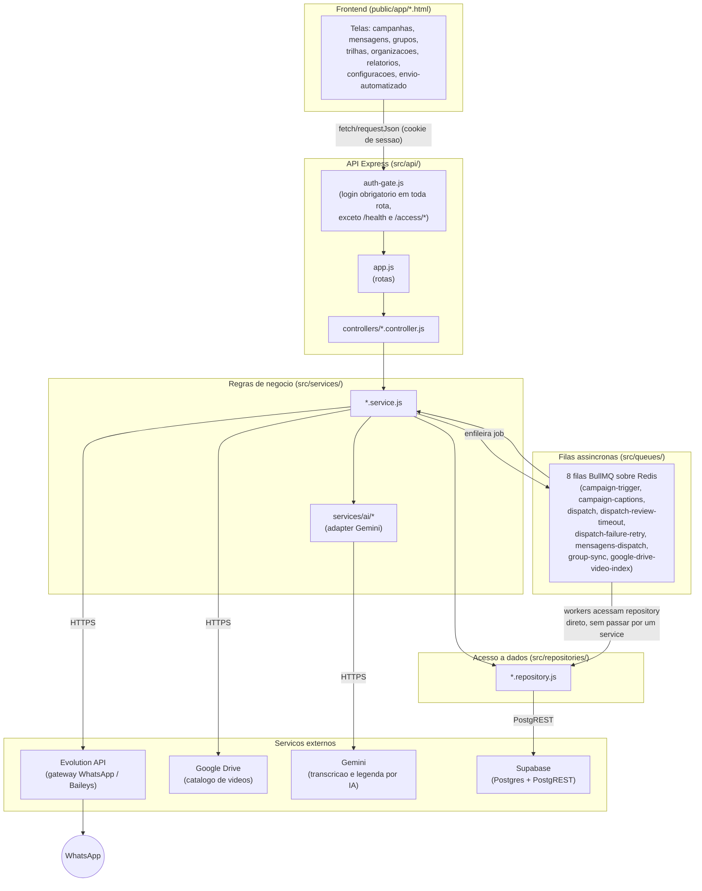
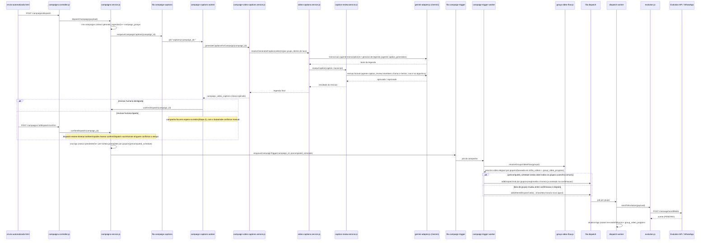
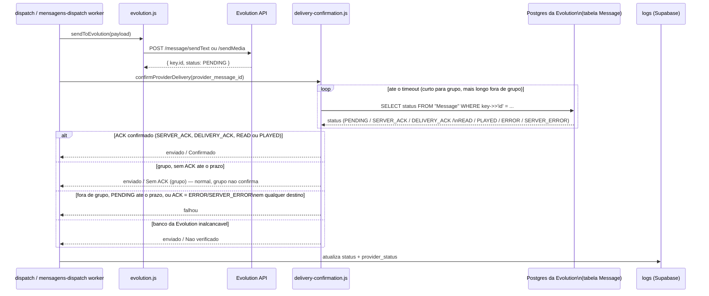
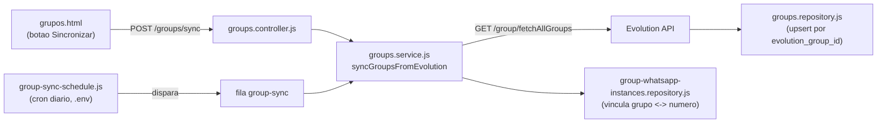
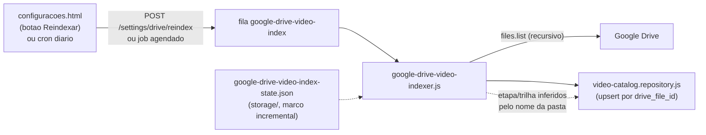

# Arquitetura do Sistema: Diagramas de Ponta a Ponta

## Resumo

Este documento reúne os diagramas da arquitetura completa do projeto, do
clique na tela até a mensagem chegar no WhatsApp: as camadas do código
(frontend, API, serviços, banco), os dois caminhos de disparo que existem
(campanha de trilha e disparo pontual), a sincronização de grupos, a
indexação de vídeos do Google Drive, a confirmação de entrega e o diagrama
completo do banco de dados. Cada diagrama vem acompanhado da lista de
arquivos reais envolvidos, para servir tanto de mapa visual quanto de
referência de código. Este documento não substitui `docs/filas.md` (que
detalha regras de negócio de cada fila) nem `README.md` (visão geral do
projeto) — ele existe para mostrar como as peças se encaixam.

---

## 1. Visão geral em camadas

O fluxo de dependência é sempre numa única direção, nunca ao contrário:
nenhum controller acessa repository ou banco direto, e nenhum repository
chama um service de volta. A única simplificação a notar é que **as filas
não passam sempre por um service antes de tocar num repository** — os
workers (`campaign-trigger.js`, `dispatch.js`, `mensagens-dispatch.js` e
outros) importam vários `*.repository.js` diretamente, porque o próprio
worker já é a camada de orquestração daquele fluxo:



Nenhum controller fala direto com o banco, e nenhum repository chama um
service de volta — essa disciplina de camadas é o que permite trocar, por
exemplo, o provedor de IA ou o gateway de WhatsApp sem reescrever regra de
negócio espalhada pelo código. Os quatro serviços externos do diagrama
(Evolution API, Google Drive, Gemini, Supabase) são os únicos citados como
integração de negócio no `README.md`; o Sentry existe mas é observabilidade,
não faz parte deste fluxo de dados.

## 2. Mapa de telas → endpoints principais

| Tela | Endpoints principais que ela chama |
|---|---|
| `campanhas.html` | `GET /campaigns` (lista), `POST /campaigns/:id/pause`, `/resume`, `/cancel`, `GET /campaigns/:id/groups`, `GET /campaigns/:id/captions/progress`. **Não** chama `POST /campaigns` nem `GET /campaigns/:id` — essas rotas existem na API mas quem as usa é `envio-automatizado.html` |
| `envio-automatizado.html` | `POST /campaigns/dispatch` (Etapa 1, cria a campanha e dispara a geração de legenda), `POST /campaigns/:id/dispatch/confirm` (Etapa 2, é este endpoint que efetivamente enfileira `campaign-trigger` — ver Seção 3), além de `GET /groups/search`, `GET /trilhas`, `GET /settings/schedule`, `GET /organizations`, edição/regeneração de legenda (`PATCH` e `POST .../regenerate` em `/campaigns/:id/captions/:captionRowId`) e `DELETE /campaigns/:id` |
| `mensagens.html` (Disparador Pontual) | `GET /groups/search`, `POST /mensagens/dispatch/async`, `POST /mensagens/dispatch/schedule` (e as variantes `/media`), `GET /mensagens/dispatch/status/:campaignId`. **`POST /mensagens/dispatch` (a variante síncrona) existe na API mas não é chamada pelo painel** — só é alcançável por script/integração externa |
| `grupos.html` | `GET /groups/search`, `POST /groups/sync`, `PATCH /groups/:id`, `GET /settings/whatsapp/instances`, `GET /organizations`, `GET /group-profiles` |
| `trilhas.html` | Além dos endpoints de leitura (`GET /trilhas/overview`, `/sequence`, `/desvios`, `/selectable-videos`), gerencia o cadastro completo de trilhas: `POST/PATCH/DELETE /trilhas` e `/trilhas/:id`, gestão de vídeos na trilha (`POST/DELETE /trilhas/:id/videos*`, `/move`, `/reorder`), `PATCH /trilhas/:id/perfis`, `GET /trilhas/:id/usage`, edição de legenda em `/video-catalog/:id/captions` e `GET/POST /group-profiles` |
| `organizacoes.html` | `GET/POST/PATCH/DELETE /organizations`, `GET /groups/search` |
| `relatorios.html` | `GET /reports/dispatches`, `DELETE /reports/dispatches` (ação de admin, oculta registros do relatório), mais `GET /organizations`, `/groups/search`, `/settings/schedule` como filtros |
| `configuracoes.html` | `GET/PATCH /settings/*`, `GET/POST/PATCH/DELETE /group-profiles`, `GET/POST/PATCH/DELETE /settings/whatsapp/instances` (usa `fetch` direto, não passa pelo helper `requestJson` das outras telas) |

Todas as rotas de negócio exigem sessão de login (`authGate.middleware` em
`src/api/app.js`); as únicas exceções são `/health` e `/access/*`.

## 3. Fluxo 1: campanha de vídeo por trilha (do cadastro ao envio)

Este é o caminho automático: uma campanha de vídeo escolhe sozinha, por
grupo, qual vídeo enviar, gera a legenda por IA e dispara.



**Arquivos envolvidos, nesta ordem:**

| Etapa | Arquivo |
|---|---|
| Rota HTTP | `src/api/app.js` → `src/api/controllers/campaigns.controller.js` |
| Orquestração da campanha | `src/services/campaigns.service.js` |
| Fila de legendas | `src/queues/campaign-captions.js` |
| Geração/revisão de legenda | `src/services/campaign-video-captions.service.js`, `src/services/video-captions.service.js`, `src/services/caption-review.service.js` |
| Adapter de IA | `src/services/ai/gemini-adapter.js`, `src/services/ai/ai-settings.service.js` |
| Fila de trigger | `src/queues/campaign-trigger.js` |
| Escolha do próximo vídeo | `src/services/group-video-flow.js` |
| Fila de disparo | `src/queues/dispatch.js`, `src/queues/dispatch-jitter.js` |
| Download do vídeo | `src/services/google-drive-video-download.js` |
| Envio real | `src/services/evolution.js`, `src/services/evolution-instance-sender.js` |
| Confirmação de entrega | `src/services/delivery-confirmation.js` |
| Registro | `src/repositories/dispatch-logs.repository.js`, `src/repositories/group-video-progress.repository.js` |

## 4. Fluxo 2: Disparo Pontual (tela de Mensagens)

Existem três variantes no código, mas **a tela de Mensagens só usa duas
delas** — a rota síncrona (`POST /mensagens/dispatch`) existe na API para
uso por script/integração externa, não é chamada pelo painel:

```mermaid
sequenceDiagram
    participant UI as mensagens.html
    participant API as mensagens.controller.js
    participant MS as mensagens.service.js
    participant MSpool as media-spool.js
    participant MDQ as fila mensagens-dispatch
    participant MDW as mensagens-dispatch worker
    participant EV as evolution.js
    participant WA as Evolution API / WhatsApp

    alt Envio imediato SINCRONO (POST /mensagens/dispatch) — nao usado pela tela,\nso por script/API externa
        API->>MS: dispatchAdHoc(payload)
        MS->>MS: valida grupo a grupo, dentro do laco\n(falha so aquele grupo, nao aborta o lote)
        MS->>MS: cria campaigns (ancora) + logs (pendente)
        MS->>EV: sendToEvolution(payload) — sincrono,\ndentro da propria requisicao HTTP
        EV->>WA: POST /message/sendText ou /sendMedia
        MS->>MS: atualiza logs (enviado/falhou)
        MS-->>API: resposta HTTP com o resultado final
    else Envio imediato assincrono (POST /mensagens/dispatch/async) — usado pela tela\nno botao "Enviar agora"
        UI->>API: dispatchAsync(payload)
        API->>MS: dispatchAdHocAsync(payload)
        MS->>MS: valida o lote inteiro de uma vez\n(segmento, ativo, evolution_group_id;\naborta tudo se algum grupo for invalido)
        MS->>MS: cria campaigns + logs (pendente)
        MS->>MDQ: job sem delay
        MS-->>UI: 202 Accepted (a tela consulta\nGET /mensagens/dispatch/status/:campaignId)
        MDQ->>MDW: processa o job
        MDW->>EV: sendToEvolution(payload)
        EV->>WA: envio
        MDW->>MDW: atualiza logs
    else Agendado (POST /mensagens/dispatch/schedule) — usado pela tela\nquando ha data/hora futura
        UI->>API: schedule(payload)
        API->>MS: scheduleAdHoc(payload)
        MS->>MS: valida o lote + cobertura de instancia\n(unica das 3 variantes que checa se\nTODOS os numeros ativos alcancam o grupo)
        MS->>MS: cria campaigns + logs (pendente)
        opt tem anexo (imagem/video)
            MS->>MSpool: guarda o arquivo 1x, chaveado por SHA-256\n(TTL, nao vai dentro do job)
        end
        MS->>MDQ: job com delay ate window_start
        MDQ->>MDW: job executa na hora agendada
        MDW->>MSpool: readMediaFromSpool (se houver anexo)
        MDW->>EV: sendToEvolution(payload)
        EV->>WA: envio
        MDW->>MDW: atualiza logs\n+ releaseMediaFromSpool
    end
```

**Arquivos envolvidos:**

| Etapa | Arquivo |
|---|---|
| Rota HTTP | `src/api/app.js` → `src/api/controllers/mensagens.controller.js` |
| Regras de negócio (as 3 variantes) | `src/services/mensagens.service.js` |
| Depósito de anexo (só no caminho agendado) | `src/services/media-spool.js` |
| Compressão de mídia | `src/services/adhoc-media.js`, `src/services/video-compression.js` |
| Fila | `src/queues/mensagens-dispatch.js` |
| Envio real | `src/services/evolution.js` |
| Registro | `src/repositories/dispatch-logs.repository.js`, `src/repositories/campaigns.repository.js` |

## 5. Confirmação de entrega (ACK)

Depois que a Evolution aceita o envio, o sistema tenta confirmar se o
WhatsApp de fato entregou — com uma limitação estrutural: mensagem de grupo
não tem confirmação de leitura.



**Arquivos:** `src/services/delivery-confirmation.js`,
`src/services/evolution-message-status.js`,
`src/repositories/dispatch-logs.repository.js`.

## 6. Sincronização de grupos do WhatsApp



**Arquivos:** `src/queues/group-sync.js`, `src/queues/group-sync-schedule.js`,
`src/services/groups.service.js`, `src/repositories/groups.repository.js`,
`src/repositories/group-whatsapp-instances.repository.js`.

## 7. Indexação de vídeos do Google Drive



**Arquivos:** `src/queues/google-drive-video-index.js`,
`src/queues/google-drive-video-index-schedule.js`,
`src/services/google-drive-video-indexer.js`,
`src/services/google-drive.js`,
`src/repositories/video-catalog.repository.js`.

## 8. As 8 filas, de relance

| Fila | Arquivo do worker | Dispara | Alimenta |
|---|---|---|---|
| `campaign-trigger` | `src/queues/campaign-trigger.js` | Confirmação de uma campanha (única ou recorrente) | `dispatch` |
| `campaign-captions` | `src/queues/campaign-captions.js` | Criação de campanha de vídeo | `campaigns.service.confirmDispatch` (que alimenta `campaign-trigger`) |
| `dispatch` | `src/queues/dispatch.js` | `campaign-trigger` | Evolution API |
| `dispatch-review-timeout` | `src/queues/dispatch-review-timeout.js` | Sweep periódico | `campaigns.service.confirmDispatch` |
| `dispatch-failure-retry` | `src/queues/dispatch-failure-retry.js` | Sweep periódico sobre `logs` com falha | `dispatch` (reenvio) |
| `mensagens-dispatch` | `src/queues/mensagens-dispatch.js` | Disparo pontual (agendado ou assíncrono) | Evolution API |
| `group-sync` | `src/queues/group-sync.js` | Botão manual ou cron diário | `groups`, `group_whatsapp_instances` |
| `google-drive-video-index` | `src/queues/google-drive-video-index.js` | Botão manual ou cron diário | `video_catalog` |

## 9. Diagrama Entidade-Relacionamento do banco

Idêntico ao mantido em `README.md` (fonte de verdade visual do schema atual;
`docs/documentacao_banco.md` cobre só a versão inicial e está desatualizada).
Reproduzido aqui para este documento ficar completo por si só:

```mermaid
erDiagram
    ORGANIZATIONS ||--o{ GROUPS : possui
    ORGANIZATIONS ||--o{ CAMPAIGN_GROUPS : agrupa

    GROUP_PROFILES ||--o{ GROUPS : classifica
    GROUP_PROFILES ||--o{ TRILHA_PERFIS : habilita
    GROUP_PROFILES ||--o{ GROUP_PROFILE_MERGES : historico

    GROUPS }o--|| TRILHAS : usa
    TRILHAS ||--o{ TRILHA_VIDEOS : organiza
    VIDEO_CATALOG ||--o{ TRILHA_VIDEOS : pertence
    TRILHAS ||--o{ TRILHA_PERFIS : atende

    CAMPAIGNS ||--o{ CAMPAIGN_GROUPS : inclui
    GROUPS ||--o{ CAMPAIGN_GROUPS : participa

    GROUPS ||--o{ GROUP_VIDEO_PROGRESS : recebe
    VIDEO_CATALOG ||--o{ GROUP_VIDEO_PROGRESS : enviado
    TRILHAS ||--o{ GROUP_VIDEO_PROGRESS : contexto

    CAMPAIGNS ||--o{ LOGS : gera
    GROUPS ||--o{ LOGS : recebe
    VIDEO_CATALOG ||--o{ LOGS : registra

    VIDEO_CATALOG ||--o{ VIDEO_CAPTIONS : possui
    CAMPAIGNS ||--o{ CAMPAIGN_VIDEO_CAPTIONS : prepara
    GROUPS ||--o{ CAMPAIGN_VIDEO_CAPTIONS : recebe
    VIDEO_CATALOG ||--o{ CAMPAIGN_VIDEO_CAPTIONS : usa
    VIDEO_CAPTIONS ||--o{ CAMPAIGN_VIDEO_CAPTIONS : reutiliza

    GROUPS ||--o{ GROUP_WHATSAPP_INSTANCES : descoberto_em
    WHATSAPP_INSTANCES ||--o{ GROUP_WHATSAPP_INSTANCES : sincroniza
    WHATSAPP_INSTANCES ||--o{ LOGS : enviou_por
    APP_USERS ||--o{ LOGS : responsavel_por
    APP_USERS ||--o{ LOGS : cancelou
    APP_USERS ||--o{ CAMPAIGNS : cancelou
    GROUPS ||--o{ NOTIFICATIONS : destino
    GROUPS ||--o{ SETTINGS : grupo_notificacao

    ORGANIZATIONS {
        uuid id PK
        varchar nome
        text descricao
        text programa
        timestamptz created_at
        timestamptz updated_at
    }

    GROUP_PROFILES {
        uuid id PK
        text nome
        timestamptz created_at
    }

    GROUPS {
        uuid id PK
        uuid organization_id FK
        uuid trilha_id FK
        uuid profile_id FK
        uuid forced_next_video_id FK
        varchar nome
        text evolution_group_id
        varchar segmento
        smallint maturidade
        integer quantidade_membros
        boolean envia_video
        boolean ativo
        text trilha_override
        timestamptz last_message_sent_at
        timestamptz created_at
        timestamptz updated_at
    }

    TRILHAS {
        uuid id PK
        text macrotema
        text trilha
        timestamptz created_at
        timestamptz updated_at
    }

    TRILHA_VIDEOS {
        uuid id PK
        uuid trilha_id FK
        uuid video_id FK
        integer ordem
        timestamptz created_at
    }

    TRILHA_PERFIS {
        uuid id PK
        uuid trilha_id FK
        uuid profile_id FK
        text perfil
        text macrotema
        text trilha
        timestamptz created_at
    }

    VIDEO_CATALOG {
        uuid id PK
        text drive_file_id
        text link_video
        text nome_do_arquivo
        text pasta_atual
        text objetivo_de_aprendizagem
        text nivel
        text observacoes
        text transcript
        integer etapa
        integer ordem_geral
        varchar trilha_segmento
        varchar status
        timestamptz data_aprovacao
        timestamptz google_drive_created_at
        timestamptz created_at
        timestamptz updated_at
    }

    VIDEO_CAPTIONS {
        uuid id PK
        uuid video_id FK
        text caption_text
        timestamptz criado_em
        timestamptz ultimo_uso_em
    }

    CAMPAIGNS {
        uuid id PK
        varchar nome
        varchar cron_expression
        text status
        text tipo
        text titulo
        text classificacao
        text texto_mensagem
        text link_conteudo
        boolean ativo
        boolean possui_midia
        text link_conteudo_tipo
        date data_envio
        time horario_envio
        timestamptz window_start
        timestamptz window_end
        timestamptz status_changed_at
        integer jitter_delay_min_ms
        integer jitter_delay_max_ms
        timestamptz paused_at
        bigint total_paused_ms
        timestamptz trigger_fired_at
        text campaign_trigger_job_id
        timestamptz hidden_at
        uuid cancelado_por FK
        timestamptz created_at
        timestamptz updated_at
    }

    CAMPAIGN_GROUPS {
        uuid campaign_id PK, FK
        uuid group_id PK, FK
        uuid organization_id FK
        timestamptz created_at
    }

    CAMPAIGN_VIDEO_CAPTIONS {
        uuid id PK
        uuid campaign_id FK
        uuid group_id FK
        uuid video_id FK
        uuid caption_id FK
        text caption_text
        text status
        text erro_mensagem
        timestamptz criado_em
        timestamptz atualizado_em
    }

    GROUP_VIDEO_PROGRESS {
        uuid id PK
        uuid group_id FK
        uuid video_id FK
        uuid trilha_id FK
        timestamptz enviado_em
    }

    LOGS {
        uuid id PK
        uuid campaign_id FK
        uuid group_id FK
        uuid video_id FK
        uuid whatsapp_instance_id FK
        uuid usuario_responsavel_id FK
        uuid cancelado_por FK
        varchar status
        text mensagem_erro
        text dispatch_ref
        text provider_message_id
        text provider_status
        text dispatch_job_id
        integer retry_count
        timestamptz horario_envio_planejado
        timestamptz enviado_em
        timestamptz cancelado_em
        text cancelado_origem
        timestamptz hidden_at
        timestamptz atualizado_em
        timestamptz criado_em
    }

    APP_USERS {
        uuid id PK
        text username
        text display_name
        text password_hash
        boolean is_admin
        boolean active
        timestamptz last_login_at
        timestamptz created_at
        timestamptz updated_at
    }

    SETTINGS {
        uuid id PK
        text key
        text drive_root_folder_id
        text drive_index_cron
        text drive_index_timezone
        text default_timezone
        integer default_min_interval_min
        integer default_max_interval_min
        integer whatsapp_rotation_group_count
        uuid notification_group_id FK
        jsonb notification_events
        jsonb ai_agents
        jsonb dispatch_rules
        jsonb default_dispatch_periods
        text profile_name
        timestamptz created_at
        timestamptz updated_at
    }

    WHATSAPP_INSTANCES {
        uuid id PK
        text instance_name
        text phone_number
        text connection_state
        integer priority
        boolean active
        timestamptz paused_at
        timestamptz qr_generated_at
        timestamptz connected_at
        timestamptz last_status_check_at
        timestamptz last_sync_attempt_at
        text last_sync_error
        timestamptz created_at
        timestamptz updated_at
    }

    GROUP_WHATSAPP_INSTANCES {
        uuid id PK
        uuid group_id FK
        uuid whatsapp_instance_id FK
        timestamptz discovered_at
        timestamptz last_seen_at
    }

    NOTIFICATIONS {
        uuid id PK
        text type
        text message
        uuid group_id FK
        timestamptz read_at
        timestamptz created_at
    }

    GROUP_PROFILE_MERGES {
        uuid id PK
        uuid survivor_id FK
        uuid discarded_id
        text survivor_nome_anterior
        text discarded_nome
        text nome_resultante
        jsonb trilha_ids
        jsonb group_ids
        jsonb collapsed_trilha_ids
        timestamptz created_at
    }
```



## 10. Metodologia e verificação

Os diagramas foram construídos lendo `src/api/app.js` (rotas),
`src/api/controllers/*`, `src/services/*`, `src/queues/*` e os arquivos
`.html` de `public/app/` diretamente, seguindo a cadeia real de `require()`
entre os arquivos, não a documentação de terceiros.

Um agente de verificação independente conferiu cada seção deste documento
contra o código antes da publicação. Achados que geraram correção:

- A Seção 2 (mapa de telas → endpoints) tinha duas imprecisões factuais:
  `campanhas.html` não chama `POST /campaigns` nem `GET /campaigns/:id`
  (quem chama é `envio-automatizado.html`), e `mensagens.html` nunca chama
  `POST /mensagens/dispatch` (a variante síncrona é só para uso externo,
  fora do painel). Também faltava o endpoint mais importante do fluxo da
  Seção 3, `POST /campaigns/:id/dispatch/confirm`, na linha de
  `envio-automatizado.html`. As três correções já estão aplicadas acima.
- A Seção 3 simplificava demais a geração de legenda (o Gemini é chamado
  através de `video-captions.service.js`, não direto por
  `campaign-video-captions.service.js`, e a revisão factual também chama o
  Gemini, não é só uma checagem algorítmica) e descrevia o disparo como
  sempre sorteando horário novo, quando o caminho comum reaproveita os
  horários já sorteados na confirmação. Corrigido acima.
- A Seção 4 tratava as três variantes de disparo pontual como se
  validassem os grupos do mesmo jeito; na prática só `scheduleAdHoc` checa
  cobertura de instância, e `dispatchAdHoc` (síncrono) falha grupo a grupo
  em vez de abortar o lote inteiro como `dispatchAdHocAsync`. Corrigido
  acima.
- A Seção 1 desenhava as filas como se sempre passassem por um service
  antes de tocar num repository; vários workers acessam repository direto.
  Corrigido acima.

O diagrama ER (Seção 9), a tabela das 8 filas (Seção 8), a confirmação de
entrega (Seção 5) e os fluxos de sincronização de grupos e indexação do
Drive (Seções 6 e 7) foram conferidos e não tiveram nenhuma imprecisão
apontada.
