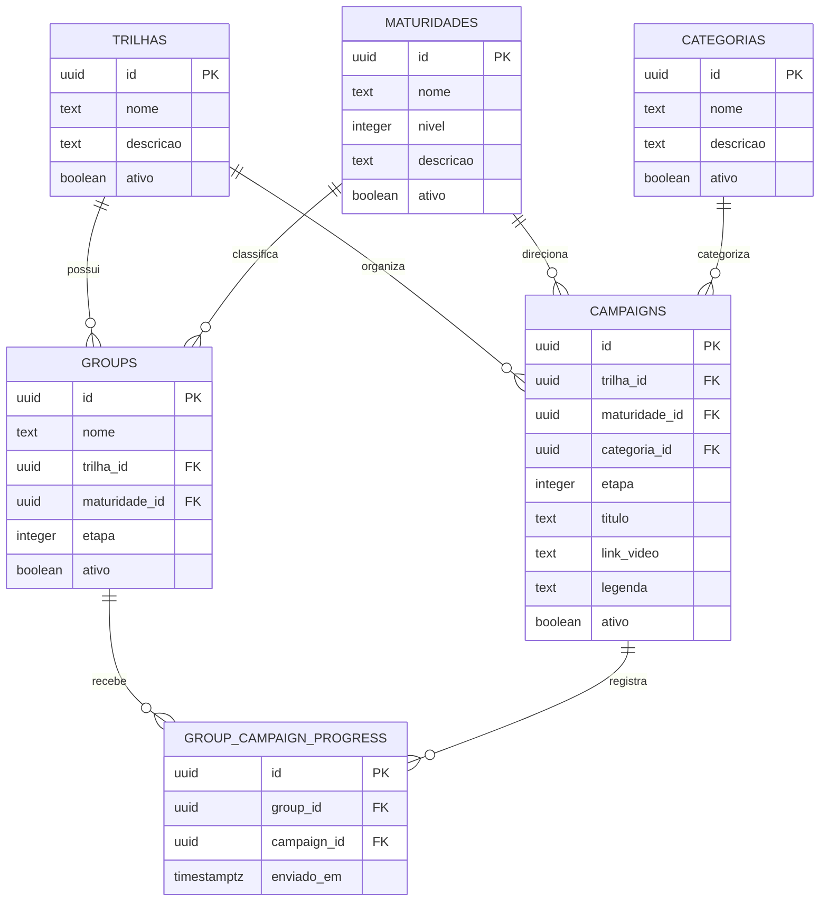
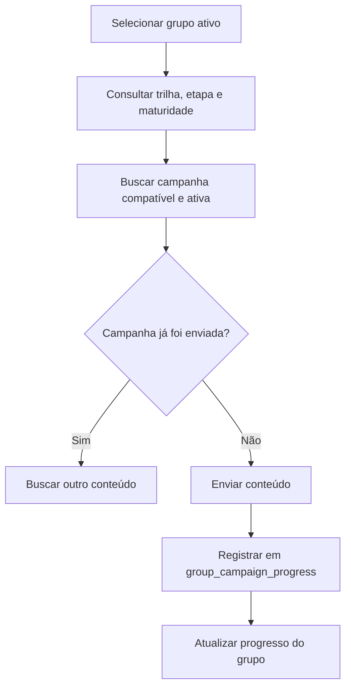

# Documentação Inicial do Banco de Dados do MVP

## 1. Visão Geral

O banco de dados do MVP organiza os grupos participantes, as trilhas de aprendizagem, os conteúdos disponíveis e o histórico de envios realizados.

A estrutura permite que cada grupo avance de forma independente dentro de uma trilha de microlearning. Para identificar o conteúdo correto, o sistema considera a trilha associada ao grupo, sua etapa atual, sua maturidade e o histórico de conteúdos já enviados.

As principais tabelas são:

- `groups`;
- `campaigns`;
- `trilhas`;
- `categorias`;
- `maturidades`;
- `group_campaign_progress`.

---

## 2. Relacionamentos Principais



---

## 3. Tabela `groups`

### 3.1 Finalidade

A tabela `groups` armazena os grupos participantes das trilhas de microlearning.

Cada registro representa um grupo do WhatsApp ou uma comunidade atendida pela plataforma. Nessa tabela também é registrada a posição atual do grupo dentro da trilha.

O campo `etapa` é utilizado para decidir qual conteúdo deve ser enviado em seguida.

### 3.2 Campos

| Campo | Significado |
|---|---|
| `id` | Identificador único do grupo |
| `nome` | Nome utilizado para identificar o grupo |
| `external_id` | Identificador do grupo no WhatsApp ou na Evolution API |
| `projeto_id` | Projeto ao qual o grupo está relacionado |
| `trilha_id` | Trilha de aprendizagem associada ao grupo |
| `maturidade_id` | Nível de maturidade associado ao grupo |
| `etapa` | Posição atual do grupo dentro da trilha |
| `ativo` | Indica se o grupo pode receber conteúdos |
| `cliente_b2b` | Empresa ou organização cliente, como Ambev ou Relay Trust |
| `persona` | Persona que representa o público do grupo, como Paulo ou Maria |
| `segmentacao` | Segmentação representada pela persona, como Pré-Infância ou Infância |
| `setor` | Setor de atuação, como Bares e Restaurantes |
| `abrangencia` | Alcance geográfico, como Brasil todo ou Nordeste |
| `estado` | Estado relacionado ao grupo, quando aplicável |
| `cidade` | Cidade relacionada ao grupo, quando aplicável |
| `timezone` | Fuso horário utilizado no agendamento |
| `janela_envio_inicio` | Horário inicial permitido para envios |
| `janela_envio_fim` | Horário final permitido para envios |
| `dias_envio` | Dias da semana permitidos para envio |
| `proximo_envio_em` | Data e horário previstos para o próximo envio |
| `ultimo_envio_em` | Data e horário do último envio |
| `descricao` | Observações adicionais sobre o grupo |
| `metadata` | Informações extras de configuração ou integração |
| `criado_em` | Data e horário de criação do registro |
| `atualizado_em` | Data e horário da última atualização |

### 3.3 Etapa Atual do Grupo

O campo `groups.etapa` representa a posição atual do grupo dentro da trilha.

```text
etapa 1 → primeiro conteúdo
etapa 2 → segundo conteúdo
etapa 3 → terceiro conteúdo
```

Se um grupo está na etapa `2`, o sistema procura uma campanha da etapa `2`, pertencente à mesma trilha e compatível com sua maturidade.

### 3.4 Exemplo de Registro

```text
id: 8f4d2b7a-3c21-4e8a-9a10-123456789abc
nome: Grupo Ambev Nordeste
trilha_id: 81a35071-d114-46df-b09c-d7743e009372
maturidade_id: b15fc814-878e-4908-a80f-309d97b7bda1
etapa: 2
ativo: true
cliente_b2b: Ambev
persona: Paulo
segmentacao: Pré-Infância
setor: Bares e Restaurantes
abrangencia: Nordeste
estado: null
cidade: null
```

---

## 4. Tabela `campaigns`

### 4.1 Finalidade

A tabela `campaigns` armazena os conteúdos programados para as trilhas de microlearning.

Cada campanha representa um conteúdo que pode ser enviado a um grupo, contendo título, link do vídeo, legenda e etapa da trilha.

### 4.2 Campos

| Campo | Significado |
|---|---|
| `id` | Identificador único da campanha |
| `trilha_id` | Trilha à qual o conteúdo pertence |
| `maturidade_id` | Nível de maturidade indicado para o conteúdo |
| `categoria_id` | Categoria ou tema do conteúdo |
| `etapa` | Posição em que o conteúdo será enviado dentro da trilha |
| `titulo` | Título do conteúdo |
| `link_video` | Link do vídeo no Google Drive ou em outra plataforma |
| `legenda` | Texto que acompanha o vídeo |
| `ativo` | Indica se o conteúdo está disponível para envio |

### 4.3 Organização por Etapa

```text
Campanha A → etapa 1
Campanha B → etapa 2
Campanha C → etapa 3
```

A correspondência principal acontece por:

```text
groups.trilha_id = campaigns.trilha_id
groups.etapa = campaigns.etapa
groups.maturidade_id = campaigns.maturidade_id
```

### 4.4 Exemplo de Registro

```text
id: 773cdfe9-9b44-4ba7-857f-ad99048858bb
trilha_id: 81a35071-d114-46df-b09c-d7743e009372
maturidade_id: b15fc814-878e-4908-a80f-309d97b7bda1
categoria_id: e6c7b04a-a229-49d9-87b9-000000000001
etapa: 2
titulo: Organização financeira para pequenos negócios
link_video: https://drive.google.com/exemplo
legenda: Confira este conteúdo sobre organização financeira.
ativo: true
```

---

## 5. Tabela `trilhas`

### Finalidade

Representa as sequências de aprendizagem disponíveis na plataforma.

### Campos

| Campo | Significado |
|---|---|
| `id` | Identificador único da trilha |
| `nome` | Nome da trilha |
| `descricao` | Descrição resumida da trilha |
| `ativo` | Indica se a trilha está disponível |
| `criado_em` | Data e horário de criação |

### Exemplo

```text
id: 81a35071-d114-46df-b09c-d7743e009372
nome: Trilha de Gestão Financeira
descricao: Conteúdos introdutórios sobre organização financeira.
ativo: true
```

---

## 6. Tabela `categorias`

### Finalidade

Organiza os conteúdos por tema ou área de conhecimento.

Exemplos: Marketing, Vendas, Gestão Financeira e Liderança.

### Campos

| Campo | Significado |
|---|---|
| `id` | Identificador único da categoria |
| `nome` | Nome da categoria |
| `descricao` | Descrição do tema |
| `ativo` | Indica se a categoria está disponível |

### Exemplo

```text
id: e6c7b04a-a229-49d9-87b9-000000000001
nome: Gestão Financeira
descricao: Conteúdos relacionados a controle financeiro e planejamento.
ativo: true
```

---

## 7. Tabela `maturidades`

### Finalidade

Representa os níveis de maturidade utilizados para classificar grupos e direcionar conteúdos.

### Campos

| Campo | Significado |
|---|---|
| `id` | Identificador único da maturidade |
| `nome` | Nome do nível |
| `nivel` | Valor numérico utilizado para ordenação |
| `descricao` | Explicação sobre o nível |
| `ativo` | Indica se o nível está disponível |

### Exemplo

```text
id: b15fc814-878e-4908-a80f-309d97b7bda1
nome: Inicial
nivel: 1
descricao: Grupo em fase inicial de desenvolvimento.
ativo: true
```

---

## 8. Tabela `group_campaign_progress`

### 8.1 Finalidade

Registra o histórico de conteúdos enviados para cada grupo.

Essa tabela permite que grupos da mesma trilha avancem em ritmos diferentes e impede que o mesmo conteúdo seja enviado novamente ao mesmo grupo.

### 8.2 Campos

| Campo | Significado |
|---|---|
| `id` | Identificador único do registro de envio |
| `group_id` | Grupo que recebeu o conteúdo |
| `campaign_id` | Campanha enviada |
| `enviado_em` | Data e horário do envio |

### 8.3 Regra de Duplicidade

A combinação abaixo deve ser única:

```text
group_id + campaign_id
```

### 8.4 Exemplo de Registro

```text
id: d1ef21c8-5010-4b4f-b7a8-000000000001
group_id: 8f4d2b7a-3c21-4e8a-9a10-123456789abc
campaign_id: 773cdfe9-9b44-4ba7-857f-ad99048858bb
enviado_em: 2026-07-13 10:30:00-03
```

---

## 9. Como o Sistema Identifica o Conteúdo a Ser Enviado

O sistema considera:

1. a trilha do grupo;
2. a etapa atual do grupo;
3. a maturidade do grupo;
4. se o grupo está ativo;
5. se a campanha está ativa;
6. se a campanha ainda não foi enviada ao grupo.

A lógica principal é:

```text
groups.trilha_id = campaigns.trilha_id
groups.etapa = campaigns.etapa
groups.maturidade_id = campaigns.maturidade_id
groups.ativo = true
campaigns.ativo = true
```

Depois, o sistema verifica se já existe um registro em `group_campaign_progress`.

### Exemplo de Consulta

```sql
select c.*
from public.groups g
join public.campaigns c
    on c.trilha_id = g.trilha_id
   and c.etapa = g.etapa
   and c.maturidade_id = g.maturidade_id
left join public.group_campaign_progress gcp
    on gcp.group_id = g.id
   and gcp.campaign_id = c.id
where g.id = 'ID_DO_GRUPO'
  and g.ativo = true
  and c.ativo = true
  and gcp.id is null
limit 1;
```

---

## 10. Regras Importantes

### Grupo ativo ou inativo

```text
groups.ativo = true  → pode receber conteúdos
groups.ativo = false → não deve receber conteúdos
```

### Campanha ativa ou inativa

```text
campaigns.ativo = true  → disponível para envio
campaigns.ativo = false → não deve ser enviada
```

### Correspondência de etapa

```text
groups.etapa = campaigns.etapa
```

Um grupo na etapa `2` deve receber um conteúdo da etapa `2`.

### Correspondência de trilha

```text
groups.trilha_id = campaigns.trilha_id
```

### Correspondência de maturidade

```text
groups.maturidade_id = campaigns.maturidade_id
```

### Histórico de envio

Após o envio, o sistema deve criar um registro em `group_campaign_progress`.

---

## 11. Fluxo Simplificado



---

## 12. Resumo dos Relacionamentos

| Origem | Destino | Finalidade |
|---|---|---|
| `groups.trilha_id` | `trilhas.id` | Identificar a trilha do grupo |
| `groups.maturidade_id` | `maturidades.id` | Identificar a maturidade do grupo |
| `campaigns.trilha_id` | `trilhas.id` | Identificar a trilha do conteúdo |
| `campaigns.maturidade_id` | `maturidades.id` | Direcionar o conteúdo por maturidade |
| `campaigns.categoria_id` | `categorias.id` | Classificar o conteúdo por tema |
| `group_campaign_progress.group_id` | `groups.id` | Identificar o grupo que recebeu |
| `group_campaign_progress.campaign_id` | `campaigns.id` | Identificar o conteúdo enviado |

---

## 13. Considerações Finais

A estrutura inicial permite:

- cadastrar grupos;
- associar grupos a trilhas;
- classificar grupos por maturidade;
- organizar conteúdos por etapa;
- classificar conteúdos por categoria;
- identificar o conteúdo correto para cada grupo;
- impedir envios duplicados;
- registrar o histórico de envios;
- permitir que cada grupo avance de forma independente.

A documentação deve ser atualizada sempre que novas tabelas, campos ou regras forem adicionados ao banco.
