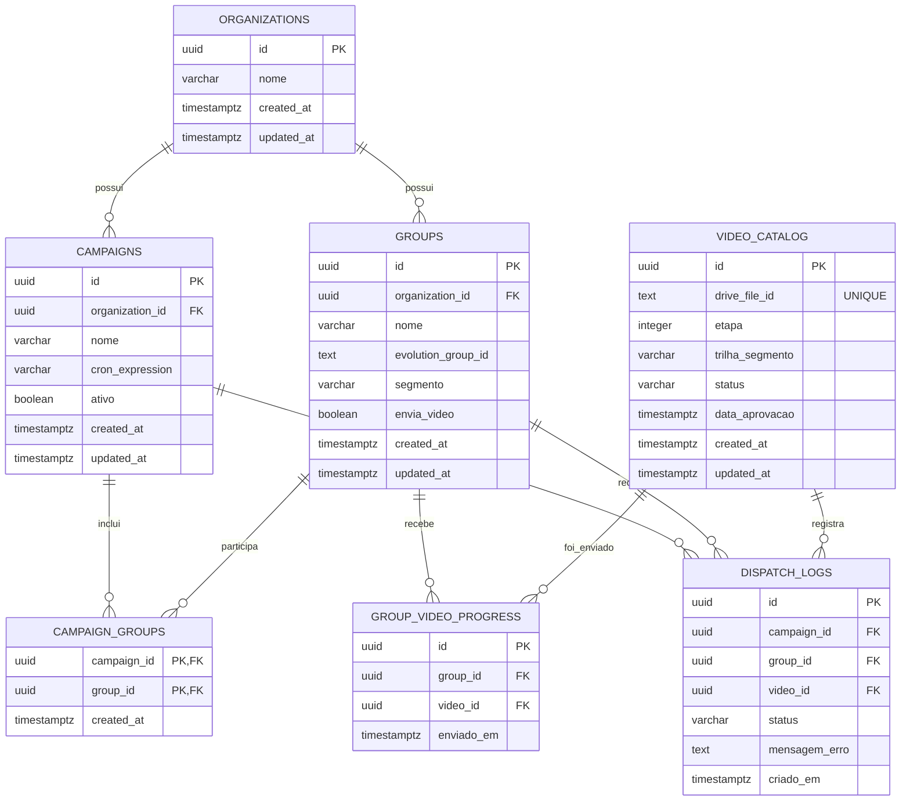
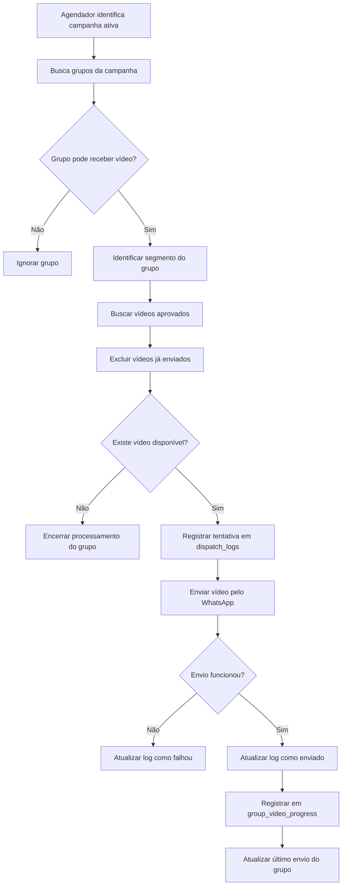

# Documentação Inicial do Banco de Dados do MVP

## 1. Visão Geral

O banco de dados do MVP organiza as organizações atendidas, os grupos de WhatsApp, o catálogo de vídeos, as campanhas de agendamento, o progresso de cada grupo e o histórico das tentativas de envio.

A estrutura foi separada para que cada parte da plataforma tenha uma responsabilidade específica:

- `organizations`: armazena os clientes B2B;
- `groups`: armazena os grupos de WhatsApp;
- `video_catalog`: armazena as referências e classificações dos vídeos;
- `campaigns`: armazena as campanhas de agendamento;
- `campaign_groups`: relaciona campanhas e grupos;
- `group_video_progress`: registra quais vídeos cada grupo já recebeu;
- `dispatch_logs`: registra as tentativas de envio.

O arquivo de vídeo não é armazenado no banco. Apenas o identificador do arquivo no Google Drive e seus metadados são registrados.

---

## 2. Relacionamentos Principais



---

## 3. Tabela `organizations`

### 3.1 Finalidade

A tabela `organizations` armazena os clientes B2B atendidos pela plataforma.

Exemplos:

- Ambev;
- Relay Trust.

Essa tabela evita repetir o nome do cliente em todos os grupos e campanhas.

### 3.2 Campos

| Campo | Significado |
|---|---|
| `id` | Identificador único da organização |
| `nome` | Nome da organização ou cliente B2B |
| `created_at` | Data e horário de criação do registro |
| `updated_at` | Data e horário da última atualização |

### 3.3 Exemplo de Registro

```text
id: 9f841693-dfe7-4ce2-9709-78cd3dbb6afe
nome: Ambev
created_at: 2026-07-13 14:00:00-03
updated_at: 2026-07-13 14:00:00-03
```

---

## 4. Tabela `groups`

### 4.1 Finalidade

A tabela `groups` armazena os grupos reais do WhatsApp que participam da operação.

Cada grupo pertence a uma organização e pode participar de uma ou mais campanhas.

### 4.2 Campos

| Campo | Significado |
|---|---|
| `id` | Identificador único do grupo |
| `organization_id` | Organização à qual o grupo pertence |
| `nome` | Nome usado para identificar o grupo |
| `evolution_group_id` | Identificador do grupo na Evolution API ou no WhatsApp |
| `segmento` | Segmento ou perfil do público do grupo |
| `envia_video` | Indica se o grupo pode receber vídeos |
| `created_at` | Data e horário de criação |
| `updated_at` | Data e horário da última atualização |

### 4.3 Regras Importantes

```text
envia_video = true  → o grupo pode entrar no fluxo de envio
envia_video = false → o grupo deve ser ignorado pelo agendador
```

O campo `evolution_group_id` deve ser único para evitar o cadastro duplicado do mesmo grupo.

O campo `last_message_sent_at` é atualizado quando um envio é concluído com status `sent`.

### 4.4 Exemplo de Registro

```text
id: a4ac594b-9f97-4d64-84a4-365338f13211
organization_id: 9f841693-dfe7-4ce2-9709-78cd3dbb6afe
nome: Grupo Ambev Nordeste
evolution_group_id: 120363000000000000@g.us
segmento: Pré-Infância
envia_video: true
trilha_override: null
```

---

## 5. Tabela `video_catalog`

### 5.1 Finalidade

A tabela `video_catalog` armazena as referências dos vídeos disponíveis no Google Drive e os metadados usados na curadoria.

O arquivo de vídeo não é salvo no banco.

A tabela armazena apenas:

- o identificador do arquivo no Drive;
- a etapa do conteúdo;
- a trilha ou segmento ao qual ele pertence;
- o status de revisão;
- a data de aprovação.

### 5.2 Campos

| Campo | Significado |
|---|---|
| `id` | Identificador interno do vídeo |
| `drive_file_id` | Identificador único do arquivo no Google Drive |
| `etapa` | Posição do vídeo dentro da sequência de conteúdos |
| `trilha_segmento` | Trilha ou segmento para o qual o vídeo é indicado |
| `status` | Situação atual do vídeo no processo de curadoria |
| `data_aprovacao` | Data e horário em que o vídeo foi aprovado |
| `created_at` | Data e horário de criação |
| `updated_at` | Data e horário da última atualização |

### 5.3 Valores Permitidos para `status`

```text
pendente_revisao
aprovado
reprovado
inativo
```

O valor padrão é:

```text
pendente_revisao
```

Quando o status for `aprovado`, o campo `data_aprovacao` deve estar preenchido.

### 5.4 Significado da Etapa

A etapa indica a posição do vídeo na sequência de uma trilha ou segmento.

```text
etapa 1 → primeiro vídeo
etapa 2 → segundo vídeo
etapa 3 → terceiro vídeo
```

O próximo vídeo de um grupo é identificado a partir do segmento ou da trilha do grupo e dos vídeos que ainda não foram registrados em `group_video_progress`.

### 5.5 Exemplo de Registro

```text
id: edafae61-2305-4552-bef6-1f20cfc6a8c0
drive_file_id: 1AbCDeFGhijkLMNopQRstuVWXyz
etapa: 1
trilha_segmento: Pré-Infância
status: aprovado
data_aprovacao: 2026-07-13 14:30:00-03
```

---

## 6. Tabela `campaigns`

### 6.1 Finalidade

A tabela `campaigns` armazena as campanhas responsáveis por definir quando o processo de envio deve ser executado.

Uma campanha pertence a uma organização e pode ser associada a vários grupos.

A campanha não armazena o vídeo. Ela controla o agendamento.

### 6.2 Campos

| Campo | Significado |
|---|---|
| `id` | Identificador único da campanha |
| `organization_id` | Organização responsável pela campanha |
| `nome` | Nome da campanha |
| `cron_expression` | Expressão que define a frequência e o horário da execução |
| `ativo` | Indica se a campanha pode ser executada |
| `created_at` | Data e horário de criação |
| `updated_at` | Data e horário da última atualização |

### 6.3 Regra de Ativação

```text
ativo = true  → a campanha pode ser executada
ativo = false → a campanha deve ser ignorada pelo agendador
```

### 6.4 Exemplo de Registro

```text
id: 26badcb0-e2ab-42e1-b49c-a8fe41a8e8d4
organization_id: 9f841693-dfe7-4ce2-9709-78cd3dbb6afe
nome: Envios Semanais Ambev
cron_expression: 0 10 * * 1
ativo: true
```

---

## 7. Tabela `campaign_groups`

### 7.1 Finalidade

A tabela `campaign_groups` relaciona as campanhas aos grupos participantes.

Ela é necessária porque uma campanha pode conter vários grupos e um grupo pode participar de mais de uma campanha.

### 7.2 Campos

| Campo | Significado |
|---|---|
| `campaign_id` | Campanha associada |
| `group_id` | Grupo participante |
| `created_at` | Data e horário em que a associação foi criada |

### 7.3 Regra de Duplicidade

```text
campaign_id + group_id
```

A combinação é a chave primária e impede que o mesmo grupo seja adicionado duas vezes à mesma campanha.

### 7.4 Exemplo de Registro

```text
campaign_id: 26badcb0-e2ab-42e1-b49c-a8fe41a8e8d4
group_id: a4ac594b-9f97-4d64-84a4-365338f13211
created_at: 2026-07-13 15:00:00-03
```

---

## 8. Tabela `group_video_progress`

### 8.1 Finalidade

A tabela `group_video_progress` registra quais vídeos já foram enviados para cada grupo.

Ela permite que cada grupo avance de forma independente e impede que o mesmo vídeo seja reenviado ao mesmo grupo.

### 8.2 Campos

| Campo | Significado |
|---|---|
| `id` | Identificador único do registro |
| `group_id` | Grupo que recebeu o vídeo |
| `video_id` | Vídeo enviado |
| `enviado_em` | Data e horário do envio |

### 8.3 Regra de Duplicidade

```text
group_id + video_id
```

Essa combinação deve ser única.

### 8.4 Exemplo de Registro

```text
id: 1a4a21eb-4600-436b-8a1b-6c820eb8a455
group_id: a4ac594b-9f97-4d64-84a4-365338f13211
video_id: edafae61-2305-4552-bef6-1f20cfc6a8c0
enviado_em: 2026-07-13 15:10:00-03
```

---

## 9. Tabela `dispatch_logs`

### 9.1 Finalidade

A tabela `dispatch_logs` registra cada tentativa de envio feita pelo sistema.

Ela permite identificar qual campanha iniciou a tentativa, qual grupo seria atendido, qual vídeo foi utilizado, se o envio funcionou ou falhou e quando a tentativa ocorreu.

### 9.2 Campos

| Campo | Significado |
|---|---|
| `id` | Identificador único do log |
| `campaign_id` | Campanha que iniciou o envio |
| `group_id` | Grupo que recebeu ou deveria receber o vídeo |
| `video_id` | Vídeo relacionado à tentativa |
| `status` | Situação da tentativa |
| `mensagem_erro` | Detalhes do erro, quando houver |
| `criado_em` | Data e horário do registro |

### 9.3 Valores Permitidos para `status`

```text
pendente
processando
enviado
falhou
```

### 9.4 Exemplo de Registro

```text
id: 89936959-b25c-44af-b061-b6d318c08efb
campaign_id: 26badcb0-e2ab-42e1-b49c-a8fe41a8e8d4
group_id: a4ac594b-9f97-4d64-84a4-365338f13211
video_id: edafae61-2305-4552-bef6-1f20cfc6a8c0
status: enviado
mensagem_erro: null
criado_em: 2026-07-13 15:10:00-03
```

---

## 10. Como o Sistema Identifica o Próximo Vídeo

O sistema pode seguir este processo:

1. identificar uma campanha ativa;
2. buscar seus grupos em `campaign_groups`;
3. ignorar grupos com `envia_video = false`;
4. identificar o segmento do grupo;
5. buscar apenas vídeos aprovados no `video_catalog`;
6. excluir os vídeos já registrados em `group_video_progress`;
7. ordenar os vídeos por etapa;
8. selecionar o primeiro vídeo disponível;
9. registrar a tentativa em `dispatch_logs`;
10. após o sucesso, registrar o vídeo em `group_video_progress`;
11. atualizar `groups.last_message_sent_at`.

### 10.1 Exemplo de Consulta

```sql
select vc.*
from public.groups g
join public.video_catalog vc
    on vc.trilha_segmento = coalesce(g.trilha_override, g.segmento)
left join public.group_video_progress gvp
    on gvp.group_id = g.id
   and gvp.video_id = vc.id
where g.id = 'ID_DO_GRUPO'
  and g.envia_video = true
  and vc.status = 'aprovado'
  and gvp.id is null
order by vc.etapa
limit 1;
```

---

## 11. Fluxo Simplificado de Envio



---

## 12. Resumo dos Relacionamentos

| Origem | Destino | Finalidade |
|---|---|---|
| `groups.organization_id` | `organizations.id` | Identificar a organização do grupo |
| `campaigns.organization_id` | `organizations.id` | Identificar a organização da campanha |
| `campaign_groups.campaign_id` | `campaigns.id` | Identificar a campanha |
| `campaign_groups.group_id` | `groups.id` | Identificar o grupo participante |
| `group_video_progress.group_id` | `groups.id` | Identificar o grupo que recebeu o vídeo |
| `group_video_progress.video_id` | `video_catalog.id` | Identificar o vídeo enviado |
| `dispatch_logs.campaign_id` | `campaigns.id` | Identificar a campanha que iniciou a tentativa |
| `dispatch_logs.group_id` | `groups.id` | Identificar o grupo da tentativa |
| `dispatch_logs.video_id` | `video_catalog.id` | Identificar o vídeo da tentativa |

---

## 13. Regras Importantes

### Organização

O nome da organização deve ser único.

### Grupo

- `evolution_group_id` deve ser único;
- grupos com `envia_video = false` não recebem novos vídeos;
- todo grupo pertence a uma organização;
- `last_message_sent_at` registra o último envio concluído.

### Vídeo

- `drive_file_id` deve ser único;
- nenhum conteúdo binário é armazenado no banco;
- somente vídeos com status `aprovado` podem ser enviados;
- vídeos aprovados devem possuir `data_aprovacao`;
- a etapa deve ser maior ou igual a 1.

### Campanha

- toda campanha pertence a uma organização;
- somente campanhas ativas devem ser executadas;
- `cron_expression` define quando a campanha será processada.

### Progresso

- o mesmo vídeo não pode ser registrado duas vezes para o mesmo grupo;
- cada grupo possui seu próprio histórico;
- grupos diferentes podem avançar em ritmos diferentes.

### Logs

- cada tentativa deve possuir um status válido;
- em caso de falha, `mensagem_erro` pode guardar a causa;
- `dispatch_logs` registra tentativas;
- `group_video_progress` registra apenas vídeos considerados enviados.

---

## 14. Diferença entre as Tabelas de Controle

### `campaigns`

Define quando uma rotina de envio deve ser executada.

### `campaign_groups`

Define quais grupos participam da campanha.

### `video_catalog`

Define quais vídeos estão disponíveis e aprovados.

### `dispatch_logs`

Registra cada tentativa de envio, incluindo falhas.

### `group_video_progress`

Registra os vídeos já enviados para cada grupo.

---

## 15. Considerações Finais

A estrutura permite:

- cadastrar clientes B2B;
- descrever o contexto de cada organização;
- cadastrar grupos de WhatsApp;
- associar grupos a campanhas;
- organizar vídeos por etapa e segmento;
- controlar a aprovação dos vídeos;
- identificar o próximo vídeo disponível;
- impedir reenvios duplicados;
- registrar falhas e sucessos;
- consultar o último envio feito para cada grupo;
- permitir que cada grupo avance de forma independente.

A documentação deve ser atualizada sempre que novas tabelas, campos ou regras de negócio forem adicionados ao banco.