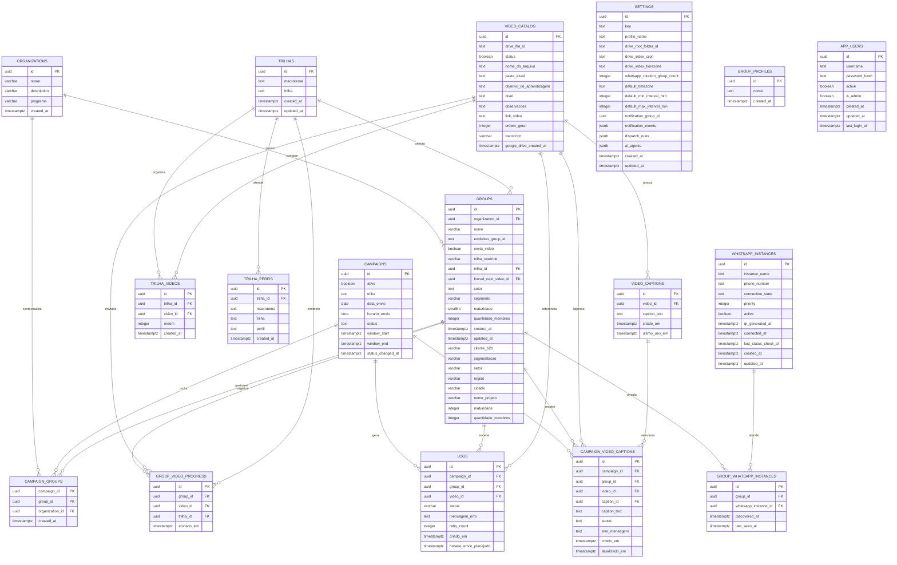
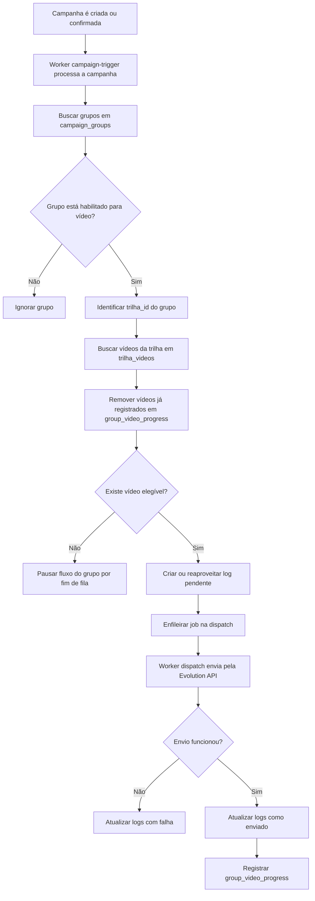

# Documentação do Banco de Dados

> **Escopo desta documentação (revisado em 29/07/2026).**
> Este documento descreve o schema inicial do MVP (migration `202607140001`) e
> cobre apenas 7 das tabelas em uso. A fonte de verdade do schema é sempre
> `supabase/migrations/`.
>
> **Não documentadas aqui ainda:** `trilhas`, `trilha_perfis`, `settings`,
> `whatsapp_instances`, `group_whatsapp_instances`, `group_profiles`,
> `video_captions`, `campaign_video_captions`.
>
> Também não refletidas abaixo: colunas adicionadas depois de 14/07 (por exemplo
> `groups.trilha_id`, `groups.maturidade`, `groups.segmento`,
> `campaigns.status`, `dispatch_logs.retry_count`) e colunas já removidas
> (`trilhas.organization_id`, e as colunas legadas de trilha em `video_catalog`:
> `macrotema`, `trilha`, `ordem`, `perfil_da_jornada`).
>
> **Atualizado em 26/08/2026:** incluída a tabela `app_users` (migration
> `202608100001`), que guarda os logins do painel administrativo e não
> constava no diagrama nem na lista acima. As demais tabelas listadas como
> não documentadas continuam pendentes.

## 1. Visão Geral

O banco de dados organiza a operação de envio de conteúdos para grupos de WhatsApp. A estrutura atual separa clientes, grupos, campanhas, trilhas, catálogo de vídeos, legendas, instâncias de WhatsApp e logs de envio.

Essa separação evita que regras importantes fiquem misturadas em uma única tabela. Por exemplo, a tabela `video_catalog` descreve o arquivo de vídeo, enquanto `trilha_videos` define em quais trilhas esse vídeo aparece e em qual ordem. Assim, o mesmo vídeo pode ser reaproveitado em mais de uma trilha sem duplicar metadados.

As tabelas descritas abaixo foram conferidas no Supabase em 2026-07-29.

## 2. Diagrama Entidade-Relacionamento


```mermaid
erDiagram
    ORGANIZATIONS ||--o{ GROUPS : possui
    ORGANIZATIONS ||--o{ CAMPAIGN_GROUPS : contextualiza

    CAMPAIGNS ||--o{ CAMPAIGN_GROUPS : inclui
    GROUPS ||--o{ CAMPAIGN_GROUPS : participa

    TRILHAS ||--o{ GROUPS : orienta
    TRILHAS ||--o{ TRILHA_VIDEOS : organiza
    VIDEO_CATALOG ||--o{ TRILHA_VIDEOS : compoe
    TRILHAS ||--o{ TRILHA_PERFIS : atende

    GROUPS ||--o{ GROUP_VIDEO_PROGRESS : registra
    VIDEO_CATALOG ||--o{ GROUP_VIDEO_PROGRESS : enviado
    TRILHAS ||--o{ GROUP_VIDEO_PROGRESS : contexto

    CAMPAIGNS ||--o{ LOGS : gera
    GROUPS ||--o{ LOGS : recebe
    VIDEO_CATALOG ||--o{ LOGS : referencia

    VIDEO_CATALOG ||--o{ VIDEO_CAPTIONS : possui
    CAMPAIGNS ||--o{ CAMPAIGN_VIDEO_CAPTIONS : usa
    GROUPS ||--o{ CAMPAIGN_VIDEO_CAPTIONS : recebe
    VIDEO_CATALOG ||--o{ CAMPAIGN_VIDEO_CAPTIONS : legenda
    VIDEO_CAPTIONS ||--o{ CAMPAIGN_VIDEO_CAPTIONS : seleciona

    GROUPS ||--o{ GROUP_WHATSAPP_INSTANCES : vincula
    WHATSAPP_INSTANCES ||--o{ GROUP_WHATSAPP_INSTANCES : atende

    ORGANIZATIONS {
        uuid id PK
        varchar nome
        varchar description
        varchar programa
        timestamptz created_at
    }

    GROUPS {
        uuid id PK
        uuid organization_id FK
        varchar nome
        text evolution_group_id
        boolean envia_video
        varchar trilha_override
        uuid trilha_id FK
        uuid forced_next_video_id FK
        text setor
        varchar segmento
        smallint maturidade
        integer quantidade_membros
        timestamptz created_at
        timestamptz updated_at
        varchar cliente_b2b
        varchar segmentacao
        varchar setor
        varchar regiao
        varchar cidade
        varchar nome_projeto
        integer maturidade
        integer quantidade_membros
    }

    CAMPAIGNS {
        uuid id PK
        boolean ativo
        text trilha
        date data_envio
        time horario_envio
        text status
        timestamptz window_start
        timestamptz window_end
        timestamptz status_changed_at
    }

    CAMPAIGN_GROUPS {
        uuid campaign_id PK
        uuid group_id PK
        uuid organization_id FK
        timestamptz created_at
    }

    TRILHAS {
        uuid id PK
        text macrotema
        text trilha
        timestamptz created_at
        timestamptz updated_at
    }

    TRILHA_VIDEOS {
        uuid id PK
        uuid trilha_id FK
        uuid video_id FK
        integer ordem
        timestamptz created_at
    }

    TRILHA_PERFIS {
        uuid id PK
        uuid trilha_id FK
        text macrotema
        text trilha
        text perfil
        timestamptz created_at
    }

    VIDEO_CATALOG {
        uuid id PK
        text drive_file_id
        boolean status
        text nome_do_arquivo
        text pasta_atual
        text objetivo_de_aprendizagem
        text nivel
        text observacoes
        text link_video
        integer ordem_geral
        varchar transcript
        timestamptz google_drive_created_at
    }

    GROUP_VIDEO_PROGRESS {
        uuid id PK
        uuid group_id FK
        uuid video_id FK
        uuid trilha_id FK
        timestamptz enviado_em
    }

    LOGS {
        uuid id PK
        uuid campaign_id FK
        uuid group_id FK
        uuid video_id FK
        varchar status
        text mensagem_erro
        integer retry_count
        timestamptz criado_em
        timestamptz horario_envio_planejado
    }

    VIDEO_CAPTIONS {
        uuid id PK
        uuid video_id FK
        text caption_text
        timestamptz criado_em
        timestamptz ultimo_uso_em
    }

    CAMPAIGN_VIDEO_CAPTIONS {
        uuid id PK
        uuid campaign_id FK
        uuid group_id FK
        uuid video_id FK
        uuid caption_id FK
        text caption_text
        text status
        text erro_mensagem
        timestamptz criado_em
        timestamptz atualizado_em
    }

    WHATSAPP_INSTANCES {
        uuid id PK
        text instance_name
        text phone_number
        text connection_state
        integer priority
        boolean active
        timestamptz qr_generated_at
        timestamptz connected_at
        timestamptz last_status_check_at
        timestamptz created_at
        timestamptz updated_at
    }

    GROUP_WHATSAPP_INSTANCES {
        uuid id PK
        uuid group_id FK
        uuid whatsapp_instance_id FK
        timestamptz discovered_at
        timestamptz last_seen_at
    }

    SETTINGS {
        uuid id PK
        text key
        text profile_name
        text drive_root_folder_id
        text drive_index_cron
        text drive_index_timezone
        integer whatsapp_rotation_group_count
        text default_timezone
        integer default_min_interval_min
        integer default_max_interval_min
        uuid notification_group_id
        jsonb notification_events
        jsonb dispatch_rules
        jsonb ai_agents
        timestamptz created_at
        timestamptz updated_at
    }

    GROUP_PROFILES {
        uuid id PK
        text nome
        timestamptz created_at
    }

    APP_USERS {
        uuid id PK
        text username
        text password_hash
        boolean active
        boolean is_admin
        timestamptz created_at
        timestamptz updated_at
        timestamptz last_login_at
    }
```

`app_users` não tem relacionamento com nenhuma outra tabela — é uma tabela isolada, usada apenas pelo gate de autenticação do painel (login/senha de quem acessa a aplicação), sem FK de/para o restante do schema. Por isso não aparece com setas no diagrama acima.

## 3. Descrição das Tabelas

| Tabela | Função no sistema |
|---|---|
| `organizations` | Guarda os clientes ou organizações atendidas pela plataforma. |
| `groups` | Representa os grupos de WhatsApp sincronizados ou cadastrados para a operação. |
| `campaigns` | Define campanhas de envio e suas janelas de execução. |
| `campaign_groups` | Relaciona campanhas com os grupos participantes e preserva a organização de contexto. |
| `trilhas` | Define trilhas de conteúdo por macrotema e nome da trilha. |
| `trilha_videos` | Relaciona vídeos com trilhas e controla a ordem de exibição dentro de cada trilha. |
| `trilha_perfis` | Indica quais perfis de grupo podem seguir determinada trilha. |
| `video_catalog` | Guarda metadados dos vídeos indexados a partir do Google Drive. |
| `video_captions` | Armazena legendas geradas ou aprovadas para cada vídeo. |
| `campaign_video_captions` | Registra a legenda usada em uma combinação de campanha, grupo e vídeo. |
| `group_video_progress` | Indica quais vídeos já foram enviados para cada grupo, considerando a trilha. |
| `logs` | Registra tentativas de envio, status, erros e horário planejado. |
| `whatsapp_instances` | Guarda instâncias de WhatsApp disponíveis para envio pela Evolution API. |
| `group_whatsapp_instances` | Relaciona grupos de WhatsApp com as instâncias que os identificaram. |
| `settings` | Centraliza parâmetros operacionais, como indexação do Drive, fuso, regras de envio e agentes de IA. |
| `group_profiles` | Lista perfis usados para classificar grupos e apoiar regras de trilhas. |
| `app_users` | Logins do painel administrativo (usuário/senha), separados dos dados de operação. |

## 4. Principais Regras de Modelagem

### Organizações e grupos

`organizations` concentra os dados do cliente B2B. A tabela `groups` referencia uma organização por `organization_id`, mas o schema atual também permite enriquecer o grupo com informações operacionais, como `segmento`, `setor`, `maturidade`, `quantidade_membros`, `envia_video` e `trilha_id`.

O campo `envia_video` funciona como uma chave operacional. Quando ele está como `false`, o grupo não deve ser considerado no fluxo automático de vídeos, mesmo que esteja associado a uma campanha.

### Trilhas e vídeos

A estrutura atual usa uma relação N:N entre `trilhas` e `video_catalog`, implementada por `trilha_videos`. Isso é melhor do que guardar a trilha diretamente no vídeo, porque um mesmo vídeo pode ser reutilizado em diferentes trilhas e com ordens diferentes.

O campo `trilha_videos.ordem` define a sequência da trilha. O campo `video_catalog.ordem_geral` ainda existe como apoio ao catálogo, mas a ordem do envio por trilha deve priorizar `trilha_videos.ordem`.

### Campanhas e envios

`campaigns` define a intenção de envio, como status, data, horário e janela operacional. A relação com grupos acontece em `campaign_groups`, permitindo que uma campanha contemple vários grupos.

Antes do envio real, o sistema cria registros em `logs`. Esses registros representam a intenção e o acompanhamento do envio. O status pode indicar estados como pendente, processando, enviado, falhou ou erro, dependendo da etapa do fluxo.

### Legendas

`video_captions` guarda legendas associadas ao vídeo. Já `campaign_video_captions` registra a legenda usada ou gerada para uma campanha, grupo e vídeo específicos. Essa separação ajuda a auditar o que foi enviado sem perder o histórico de variações de legenda.

### WhatsApp e Evolution API

`whatsapp_instances` representa as instâncias conectadas à Evolution API. `group_whatsapp_instances` registra quais grupos foram encontrados por cada instância, permitindo controle de disponibilidade, rotação e rastreabilidade.

### Autenticação do painel

`app_users` guarda os logins de quem acessa o painel administrativo (não confundir com `organizations`/clientes B2B). Cada linha tem `username`, `password_hash` (hash, nunca senha em texto puro) e `active` para desativar um acesso sem apagar o histórico. A tabela tem RLS habilitada e nenhuma policy criada — só a `service_role` key (usada pelo backend) consegue lê-la ou escrevê-la; a `anon` key nunca enxerga usuários nem hashes.

`is_admin` (migration `202608260001`) marca quem pode criar ou (des)ativar outros logins pela tela de Configurações. Substituiu a antiga senha mestra única compartilhada (`ESTIMULO_ADMIN_MASTER_PASSWORD`, removida do código): a permissão agora fica atrelada à sessão de uma conta específica, não a um segredo que qualquer pessoa com acesso ao painel conhecia.

## 5. Fluxo Simplificado de Envio


```mermaid
flowchart TD
    A[Campanha é criada ou confirmada] --> B[Worker campaign-trigger processa a campanha]
    B --> C[Buscar grupos em campaign_groups]
    C --> D{Grupo está habilitado para vídeo?}
    D -- Não --> E[Ignorar grupo]
    D -- Sim --> F[Identificar trilha_id do grupo]
    F --> G[Buscar vídeos da trilha em trilha_videos]
    G --> H[Remover vídeos já registrados em group_video_progress]
    H --> I{Existe vídeo elegível?}
    I -- Não --> J[Pausar fluxo do grupo por fim de fila]
    I -- Sim --> K[Criar ou reaproveitar log pendente]
    K --> L[Enfileirar job na dispatch]
    L --> M[Worker dispatch envia pela Evolution API]
    M --> N{Envio funcionou?}
    N -- Não --> O[Atualizar logs com falha]
    N -- Sim --> P[Atualizar logs como enviado]
    P --> Q[Registrar group_video_progress]
```

## 6. Consulta de Referência

A consulta abaixo representa a ideia central da escolha do próximo vídeo. No código, essa regra fica distribuída entre repositórios e serviços, mas a lógica de negócio é equivalente:

```sql
select
    vc.*,
    tv.ordem
from public.groups g
join public.trilha_videos tv
    on tv.trilha_id = g.trilha_id
join public.video_catalog vc
    on vc.id = tv.video_id
left join public.group_video_progress gvp
    on gvp.group_id = g.id
   and gvp.video_id = vc.id
   and (gvp.trilha_id = g.trilha_id or gvp.trilha_id is null)
where g.id = 'ID_DO_GRUPO'
  and g.envia_video = true
  and vc.status = true
  and gvp.id is null
order by tv.ordem asc, vc.ordem_geral asc
limit 1;
```

## 7. Observações sobre a Evolução do Schema

A primeira versão do MVP usava campos textuais no `video_catalog`, como `trilha`, `macrotema`, `ordem` e `perfil_da_jornada`. A versão atual migrou essa organização para tabelas próprias:

- `trilhas` guarda o macrotema e o nome da trilha.
- `trilha_videos` vincula vídeos às trilhas.
- `trilha_perfis` vincula perfis às trilhas.
- `groups.trilha_id` aponta diretamente para a trilha operacional do grupo.

Essa mudança deixa o modelo mais normalizado e reduz inconsistências causadas por comparação de texto.

## 8. Cuidados de Manutenção

- Aplicar migrations sempre em ordem cronológica.
- Evitar inserir vídeos diretamente em uma trilha sem preencher `trilha_videos.ordem`.
- Não armazenar arquivos binários no Supabase; o banco deve guardar apenas identificadores e metadados.
- Manter `logs` como registro de tentativas e `group_video_progress` como registro de envios considerados concluídos.
- Atualizar esta documentação sempre que uma nova tabela ou regra relevante for adicionada ao banco.
